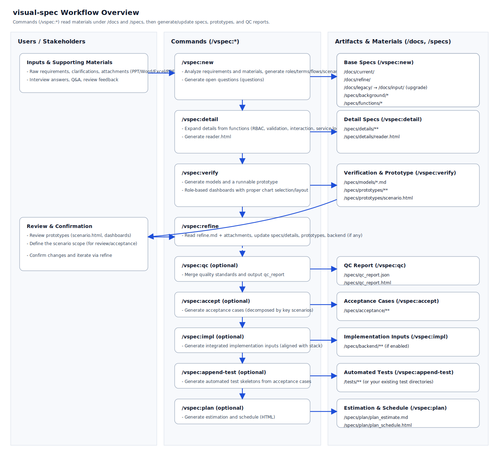

# visual-spec

[English](README.md) | [中文](README-zh-CN.md) | [日本語](README-ja-JP.md)

Turn a one-sentence idea into runnable prototypes and traceable specs with a staged `/vspec:*` workflow.

Version: 0.1.13 (2026-04-12) · License: MIT ([LICENSE](LICENSE))

## See It In 30 Seconds

Input (your raw requirement):

> “A team task board that can create projects, assign tasks, and show progress stats per person.”

After running `/vspec:new` → `/vspec:verify`:

- A runnable prototype + scenario review entry page
- Structured specs: roles, scenarios, flows, and per-function details
- Data models, plus the specs needed to review permissions/validation/logic

## Quick Start (3 Steps)

1. Install the Skill into your AI editor configuration directory (Trae / Claude Code / Cursor / GitHub Copilot, etc.):

```bash
npx skills add visual-req/visual-spec --skill visual-spec
```

2. Run `/vspec:new` and paste your requirement.
3. Answer the open questions, then run `/vspec:verify` to get a runnable prototype for review.

Beginner tutorial: [Getting started](docs/en-US/getting-started.md)

## Who This Is For

| Product / BA | Engineer | QA / Acceptance |
| --- | --- | --- |
| Turn fuzzy ideas into reviewable scenarios and prototypes | Get implementation-ready details (permissions/validation/logic) and models | Turn key scenarios into executable acceptance cases |

## Overview

Workflow diagram (SVG):



Methodology: visualized requirements analysis  
visual-spec prioritizes visualization, traceability, and early validation to reduce misunderstanding-driven rework. See: [Theory](docs/en-US/theory.md)

- Requirements analysis: generate background, stakeholders, roles, terms, flows, scenarios, details, dependencies, function list, and open questions
- Solution verification: generate data models, runnable prototypes, and a scenario review page
- Prototype generation (high-frequency): `/vspec:verify` generates a runnable Web prototype aligned with `/scheme.yaml`, including role-based dashboards (proper chart selection/layout) and a scenario review page under `/specs/prototypes/`
- Detailed design: produce RBAC/data-permission/interaction/validation/logging/notification/MQ/import-export/cron specs per function
- Acceptance & testing: generate acceptance cases and automated test code
- Integrated implementation: generate backend + frontend integrated code (aligned with the repo’s actual stack and conventions)
- Planning: estimate and schedule based on the function list (HTML output)

## Commands

| Command | Purpose | Key benefit | Main outputs |
| --- | --- | --- | --- |
| `/vspec:new` | Generate baseline spec artifacts | Turn raw text into structured, reviewable baseline | `/specs/` (background/functions/flows, etc.) |
| `/vspec:detail` | Generate per-function detailed specs | Make specs implementable and testable | `/specs/details/` |
| `/vspec:verify` | Generate data models and a runnable prototype | Validate behavior early with stakeholders | `/specs/models/`, `/specs/prototypes/` |
| `/vspec:qc` | Run quality checks on artifacts | Surface omissions/contradictions before build | `/specs/qc_report.json`, `/specs/qc_report.html` |
| `/vspec:refine` | Refine the canonical requirement and sync downstream artifacts | Keep all artifacts consistent as requirements change | updates `original.md` + sync updates to impacted artifacts |
| `/vspec:accept` | Generate acceptance test cases | Turn scenarios into acceptance language | `/specs/acceptance/` |
| `/vspec:append-test` | Generate automated test code | Reduce adoption cost for test automation | existing test directories or `/tests/` |
| `/vspec:impl` | Generate integrated backend + frontend inputs | Produce structured implementation inputs aligned to stack | `/specs/backend/` (if enabled) and related integration code |
| `/vspec:plan` | Generate estimation and schedule | Turn scope into a reviewable plan | `/specs/plan/plan_estimate.md`, `/specs/plan/plan_schedule.html` |
| `/vspec:upgrade` | Upgrade/redesign based on legacy + new inputs | Rebuild specs from existing materials | regenerated `/specs/` + synced technical selections |

If you only want the standalone quality check capability (without the full visual-spec workflow), use: https://github.com/visual-req/spec-review

## Documentation

Beginner:
- [Getting started](docs/en-US/getting-started.md)
- [Workflows](docs/en-US/workflows.md)
- [Theory](docs/en-US/theory.md)

Reference:
- [Commands](docs/en-US/commands.md)
- [Structure](docs/en-US/structure.md)
- [Installation](docs/en-US/installation.md)
- [Fork guide](docs/en-US/fork.md)

## Upgrade vs Refine

- `upgrade`: for legacy-system upgrade/rebuild scenarios; it uses `/docs/legacy/` + `/docs/current/` (and related template/text/assets inputs) to produce an upgraded target spec and technical selections.
- `refine`: for improving/adjusting an already visual-spec-structured requirement (legacy or new); it updates the canonical requirement and keeps downstream artifacts in sync.

## Directory Structure

- `skills/visual-spec/SKILL.md`: Skill definition and command workflow
- `skills/visual-spec/prompts/`: prompt files used by each command

## FAQ

- Does this work with my tech stack?  
  The prototype generated by `/vspec:verify` is web-based and follows `/scheme.yaml`. For deeper integration, see: [scheme.yaml](docs/en-US/scheme.example.yaml) and [Structure](docs/en-US/structure.md).
- Where do the outputs go?  
  Under `/specs/` (models, prototypes, details, qc reports, plan). See: [Structure](docs/en-US/structure.md).

## Contributing

- For customization, see: [Fork guide](docs/en-US/fork.md)
- To report issues or contribute changes, use GitHub Issues and Pull Requests
