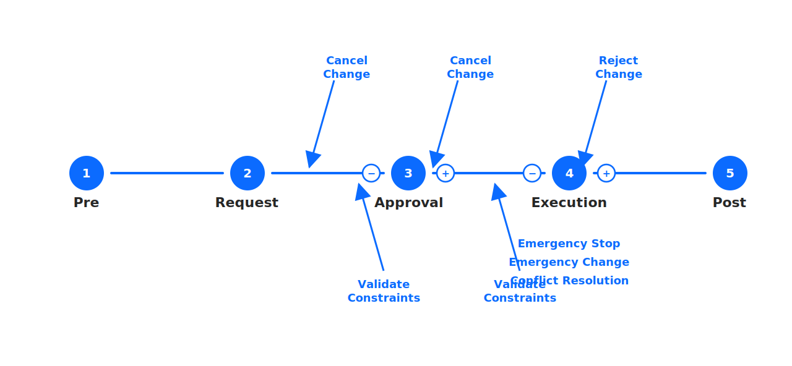
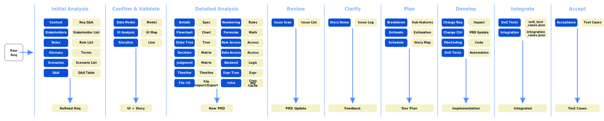

## Theory

[English](../en-US/theory.md) | [中文](../zh-CN/theory.md) | [日本語](../ja-JP/theory.md)

This section explains the core design philosophy of the visual-spec Skill: how it maps to SDLC, why the workflow is split into these command stages, why scenarios are output as an HTML review entry that links to the runnable prototype, and why [/vspec:new](../../README.md#commands) analyzes “so much” up front.

The flows abstraction (steps + control paths + constraint gates) can normalize most approval / routing workflows into one reusable backbone and drive consistent analysis outputs.

This diagram is used as a prompt checklist: map each business process to steps 1–5, then explicitly list cancellations/rejections and execution constraints, so the resulting specs and acceptance cases cover the same structure every time.

### Visual workflow

### Stage map

This diagram maps analysis stages to their typical inputs/outputs, so reviews can agree on “where we are” and what artifacts are still missing.

### Index

- SDLC mapping: why the command stages exist and how they align with SDLC  
  - See: [theory/sdlc.md](theory/sdlc.md)
- Planning: how to break down scope, estimate, and schedule, and why the story map is HTML ([/vspec:plan](../../README.md#commands))  
  - See: [theory/plan.md](theory/plan.md)
- Review ergonomics: why scenario lists are HTML and how they link to prototypes to make reviews faster  
  - See: [theory/prototype-review.md](theory/prototype-review.md)
- Reading ergonomics: how layered reading accelerates requirement understanding and reduces review friction  
  - See: [theory/reading-experience.md](theory/reading-experience.md)
- Verification & Validation: the review loop (review → refine → re-validate)  
  - See: [theory/verification_and_validation.md](theory/verification_and_validation.md)
- Why [/vspec:new](../../README.md#commands) analyzes many dimensions and how each output is reused downstream  
  - See: [theory/new-analysis.md](theory/new-analysis.md)
- Analysis thinking: break “requirements analysis” into reusable modules  
  - See: [theory/thinking-framework.md](theory/thinking-framework.md)
- Thinking modes: cover boundaries/symmetry/constraints/diversity/closed-loop so you don’t only specify the happy path  
  - See: [theory/thinking-modes.md](theory/thinking-modes.md)
- Abstraction (flows): map approval/routing processes to one backbone and stabilize control/constraint outputs  
  - See: [theory/abstraction.md](theory/abstraction.md)
- Scenario branches: enumerate scenarios, use probability/value/risk to define scope, and feed acceptance cases  
  - See: [theory/scenarios.md](theory/scenarios.md)
- Stakeholder identification: capture decision/execution/impact/constraints perspectives to avoid blind spots  
  - See: [theory/stakeholder-identification.md](theory/stakeholder-identification.md)
- Quality check: industry-agnostic dimensions and an executable QA/fix loop for requirement documents  
  - See: [theory/quality_check.md](theory/quality_check.md)

### One-line summary

visual-spec is designed to turn requirements into an end-to-end, traceable, reviewable delivery chain: scenarios as the backbone, connected to roles, rules, data models, and a runnable prototype, so teams can align before implementation and keep downstream artifacts in sync when requirements change.
