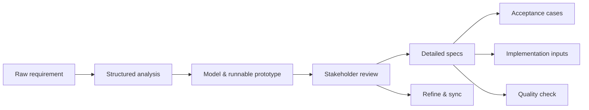

## Theory

[English](../en-US/theory.md) | [中文](../zh-CN/theory.md) | [日本語](../ja-JP/theory.md)

This section explains the core design philosophy of the visual-spec Skill: how it maps to SDLC, why the workflow is split into these command stages, why scenarios are output as an HTML review entry that links to the runnable prototype, and why [/vspec:new](../../README.md#commands) analyzes “so much” up front.

The flows abstraction (steps + control paths + constraint gates) can normalize most approval / routing workflows into one reusable backbone and drive consistent analysis outputs.

This diagram is used as a prompt checklist: map each business process to steps 1–5, then explicitly list cancellations/rejections and execution constraints, so the resulting specs and acceptance cases cover the same structure every time.

### Visual workflow

### Stage map

This diagram maps analysis stages to their typical inputs/outputs, so reviews can agree on “where we are” and what artifacts are still missing.

### Why visual-spec exists

Traditional PRDs/spec docs often fail in the same predictable ways:

- Misalignment: ambiguity stays hidden until implementation, integration, or UAT
- Late feedback: stakeholders only “see it” when it’s already expensive to change
- Change chaos: when requirements change, prototypes/tests/implementation notes drift out of sync

visual-spec is designed to shift these failures left: convert raw requirements into a traceable chain of reviewable and verifiable artifacts, before coding.

### Core workflow: how the ideas land in practice

At a high level: structured analysis → runnable validation → detailed specs → acceptance + implementation inputs → quality checks + change sync.

Command-to-artifact mapping:

- Structured analysis: [/vspec:new](../../README.md#commands) creates the baseline under `/specs/` (roles/terms/flows/scenarios/function list/open questions, etc.)
- Validation via runnable artifacts: [/vspec:verify](../../README.md#commands) generates data models + a runnable prototype, plus an HTML scenario review entry (typically `/specs/models/`, `/specs/prototypes/`)
- Detailed specs: [/vspec:detail](../../README.md#commands) turns the function list into implementable specs (typically `/specs/details/`)
- Acceptance + implementation inputs: [/vspec:accept](../../README.md#commands) writes acceptance cases (`/specs/acceptance/`); [/vspec:impl](../../README.md#commands) produces stack-aligned implementation inputs
- Quality + change loop: [/vspec:qc](../../README.md#commands) outputs QC reports; [/vspec:refine](../../README.md#commands) updates the canonical requirement and syncs impacted downstream artifacts

### Key design decisions (the “why” behind the workflow)

- Review ergonomics: runnable prototypes + HTML scenario entry reduce the barrier for non-technical stakeholders and speed up feedback cycles
- Model-first: clarify domain concepts, states, constraints, and invariants before polishing UI interactions; this reduces prototype churn caused by unstable terminology and state modeling
- Change-friendly: treat `/specs/` as derived artifacts from one canonical requirement; use [/vspec:refine](../../README.md#commands) to update the source and keep downstream outputs consistent
- Executable quality: make requirement quality checkable and repeatable via [/vspec:qc](../../README.md#commands), instead of relying on subjective “looks good” reviews

### Stage map (Command → Outputs → V&V focus)

| Stage | Command | Inputs | Main outputs (typical paths) | V&V focus |
| --- | --- | --- | --- | --- |
| 1. Structure | [/vspec:new](../../README.md#commands) | Raw requirement | `/specs/` baseline artifacts | Completeness: roles/constraints/exceptions/questions |
| 2. Verify | [/vspec:verify](../../README.md#commands) | Function list + scenarios | `/specs/models/`, `/specs/prototypes/` (incl. HTML review entry) | Correctness: behaviors match scenarios and constraints |
| 3. Detail | [/vspec:detail](../../README.md#commands) | Verified conclusions | `/specs/details/` | Consistency: permissions/validation/edge cases align |
| 4. Accept | [/vspec:accept](../../README.md#commands) | Scenarios + detailed specs | `/specs/acceptance/` | Testability: coverage of critical and risky branches |
| 5. Implement inputs | [/vspec:impl](../../README.md#commands) | Detailed specs + repo constraints | `/specs/backend/` (if enabled) and integration inputs | Feasibility: aligned with actual stack and conventions |
| 6. Quality check | [/vspec:qc](../../README.md#commands) | All `/specs/` artifacts | `/specs/qc_report.json`, `/specs/qc_report.html` | Deliverability: omissions/contradictions surfaced |
| 7. Refine & sync | [/vspec:refine](../../README.md#commands) | Review feedback/changes | updates `original.md` + synced artifacts | Traceability: changes attributed and propagated |
| 8. Plan | [/vspec:plan](../../README.md#commands) | Scope + constraints | `/specs/plan/plan_estimate.md`, `/specs/plan/plan_schedule.html` | Plannability: breakdown and scope are reviewable |

### Further reading (ordered by lifecycle)

| Topic | Doc | For |
| --- | --- | --- |
| SDLC mapping | [theory/sdlc.md](theory/sdlc.md) | PM / Tech Lead |
| Why “new” analyzes many dimensions | [theory/new-analysis.md](theory/new-analysis.md) | BA / PM |
| Analysis thinking | [theory/thinking-framework.md](theory/thinking-framework.md) | BA / PM |
| Thinking modes (incl. closed-loop) | [theory/thinking-modes.md](theory/thinking-modes.md) | Everyone |
| Stakeholder identification | [theory/stakeholder-identification.md](theory/stakeholder-identification.md) | BA / PM |
| Abstraction (flows) | [theory/abstraction.md](theory/abstraction.md) | BA / Tech Lead |
| Scenario branches | [theory/scenarios.md](theory/scenarios.md) | BA / PM / QA |
| Review ergonomics (prototype linkage) | [theory/prototype-review.md](theory/prototype-review.md) | PM / Stakeholders |
| Reading ergonomics (layered reading) | [theory/reading-experience.md](theory/reading-experience.md) | Everyone |
| Verification & Validation | [theory/verification_and_validation.md](theory/verification_and_validation.md) | QA / Tech Lead |
| Acceptance cases (scenario-driven) | [theory/acceptance.md](theory/acceptance.md) | QA / Dev / PM |
| Quality check | [theory/quality_check.md](theory/quality_check.md) | Everyone |
| Planning | [theory/planning.md](theory/planning.md) | PM |

### One-line summary

visual-spec is designed to turn requirements into an end-to-end, traceable, reviewable delivery chain: scenarios as the backbone, connected to roles, rules, data models, and a runnable prototype, so teams can align before implementation and keep downstream artifacts in sync when requirements change.
