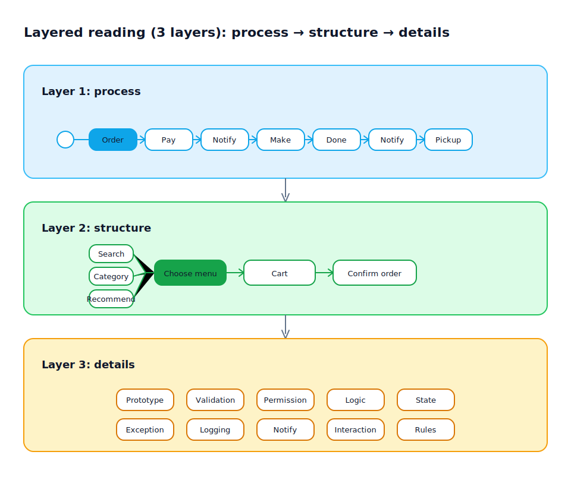

## Reading ergonomics: why layered reading makes requirements faster to understand

[English](../../en-US/theory/reading-experience.md) | [中文](../../zh-CN/theory/reading-experience.md) | [日本語](../../ja-JP/theory/reading-experience.md)

Slow requirement comprehension is often caused by reading friction rather than missing information: if readers are forced into details too early, they have to assemble the “whole picture” in their head and the cognitive load spikes.

visual-spec organizes artifacts for layered reading, so people can start from an end-to-end view and drill down only where needed—toward implementable and verifiable details.

### 1) Three-layer reading: process → structure → details

Layering is not about “document chapters”, but about a navigation path:

- Layer 1: the end-to-end business process (main path + key branches)
- Layer 2: the structure of each process node (what it’s made of, what goes in/out, how it connects)
- Layer 3: detailed specs for the node structure (implementation- and validation-ready)

Layer 3 typically includes: prototype behavior and UI interaction, validations, permissions and data permissions, business rules and state transitions, edge cases and exceptions, logging and notifications.

When artifacts are delivered as HTML and connected with links, these layers become a fast “jumpable” reading path:

- Enter from Layer 1 (process view / scenario list) to pick the node/scenario under discussion
- Jump to Layer 2 to confirm the node’s structure (inputs, actions, state changes, outputs)
- Drill down to Layer 3 by element (prototype page, validation/permissions/rules/state specs)
- Jump back up to keep reviewing without losing context

### 2) One artifact, different stakeholders, less repeated explanation

- Product/business stakeholders mostly validate Layers 1–2 (is the process correct and complete?)
- Engineers validate Layers 2–3 (is it implementable, are rules/permissions/validation precise?)
- QA/acceptance validates Layer 3 in executable terms (preconditions, steps, expected outcomes, branches)

### 3) Linked, structured objects beat linear documents at scale

Linear documents become hard to navigate and easy to desync as the artifact set grows. When information is anchored to structured objects (process nodes, scenarios, rules, fields, states, pages):

- Discussions can point to a precise target
- Reuse becomes natural (one rule referenced by many scenarios)
- Changes propagate more reliably (less “updated here but missed there”)

### 4) HTML jump-reading vs Word linear reading

At scale (many scenarios, pages, and rules), speed comes from “jumping to the answer” rather than reading front-to-back.

- HTML supports non-linear navigation: TOC, anchors, and cross-links make the reading path reconfigurable on the spot  
  - jump from scenario list → process node → prototype page / rules / data definitions
  - review feedback can be anchored to a link target instead of “page X paragraph Y”
  - layering fits naturally: upper layers are for navigation, lower layers are for explanation and validation
- Word is optimized for linear narrative: good for sequential reading, slower for high-frequency cross-referencing  
  - comparing rule ↔ prototype ↔ data definitions often costs more due to manual navigation

### 5) Outcome

Layered reading is not about splitting content; it’s about productizing the understanding process: build a shared mental model fast, then use links to close open questions with minimal switching cost.
