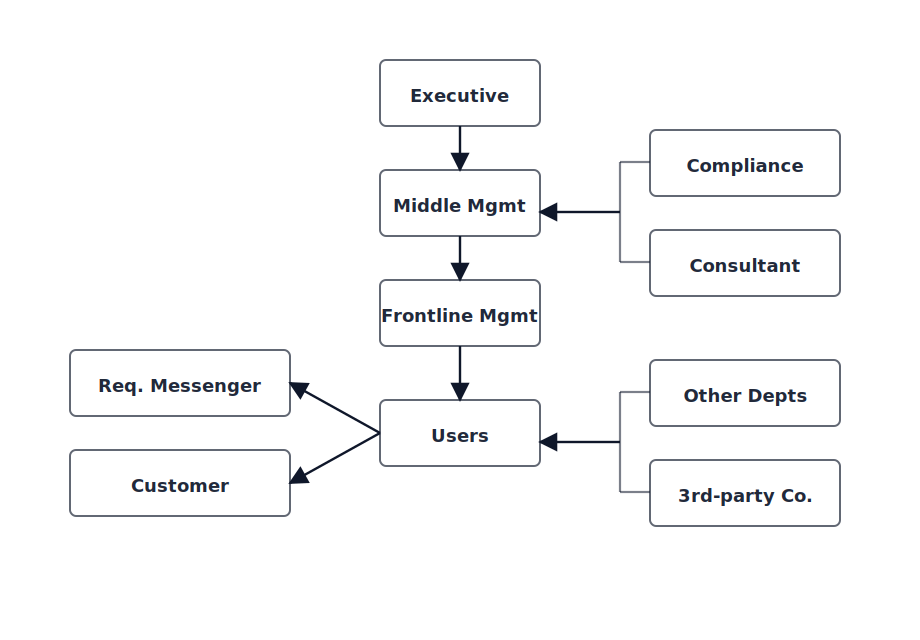

## Stakeholder identification thinking

[English](../../en-US/theory/stakeholder-identification.md) | [中文](../../zh-CN/theory/stakeholder-identification.md) | [日本語](../../ja-JP/theory/stakeholder-identification.md)

The goal is not to list role names, but to be explicit about why stakeholder identification matters and what value it brings.

The same requirement looks different from different stakeholders’ perspectives: some care about business value and boundaries, some care about rules and risk, some care about operating cost and maintainability, and others care about user experience and availability. Bringing these perspectives into the discussion early makes requirements more complete and implementable, and reduces “we missed a stakeholder / we missed a constraint” rework late in delivery.

That is why we express “where requirements come from, who makes the calls, who executes, who is impacted, and where key constraints come from” in a structured map, so you don’t end up validating only one layer or one department.

### 1) The internal decision-to-usage chain

The vertical chain in the diagram (Executive → Middle Mgmt → Frontline Mgmt → Users) is the main “decision → management → execution → usage” path inside an organization:

- Executive: sets direction and boundaries (goals, compliance baseline, investment cap) and often owns final trade-offs.
- Middle management: translates goals into executable rules and metrics (process definitions, approval rules, allocation policies).
- Frontline management: owns day-to-day execution (scheduling, exception handling, operational rollout) and is a major source of “implicit rules”.
- Users: real operators and recipients; define interaction, efficiency, and experience constraints.

Arrows show how scope and rules propagate. Reviews should ensure each layer is represented or explicitly covered.

### 2) Requirement sources and service targets: “Customer” is both

The left-side boxes (“Req. Messenger”, “Customer”) point to “Users”, highlighting that requirements are often forwarded rather than directly proposed by end users:

- Req. messenger: people who relay frontline pain points (ops, support, implementation). They bring cases and constraints but can introduce bias, so validate back with users.
- Customer: buyer/contract owner. They are not only a requirement source but also a service target. They anchor contract scope and acceptance criteria, and they also define what “success” looks like in terms of delivery quality and satisfaction. Validate both prioritization and service outcomes.

### 3) Constraints and side influences: compliance, consulting, other depts, third parties

The right-side braces group stakeholders that may not drive the main flow but strongly shape the solution via constraints, reviews, or dependencies:

- Compliance + Consultant → towards Middle Mgmt: policies and audits typically affect “rules and definitions” and must be translated into executable flows and audit points.
- Other depts + 3rd-party Co. → towards Users: cross-team collaboration and external systems often manifest at the execution/usage level (interfaces, handoffs, SLAs, incident coordination).

### Where it lands in `/vspec:new`

- Capture both the main chain and side influences in baseline artifacts (stakeholders/roles), and for each stakeholder record: concerns, constraints, decision rights, and validation criteria.
- Turn “who decides what” into explicit open questions and a decision list (who confirms rules, compliance, acceptance), so reviews don’t stall due to missing decision makers.
