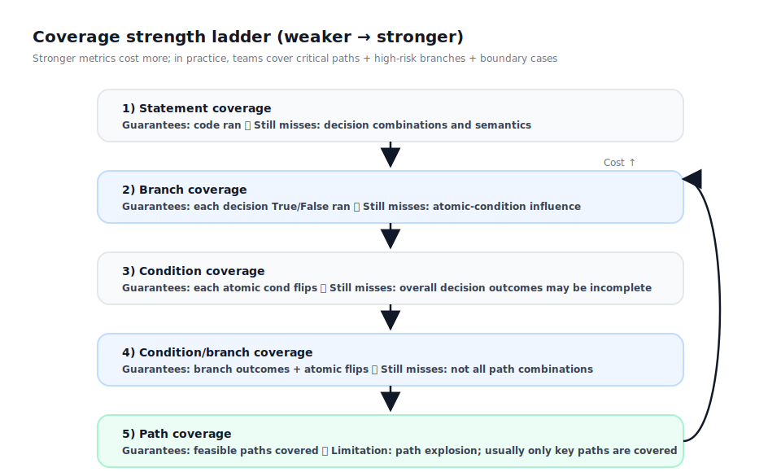
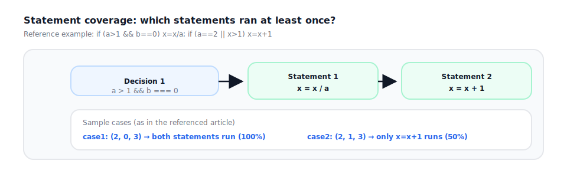
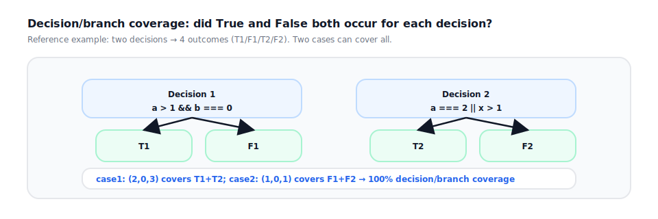
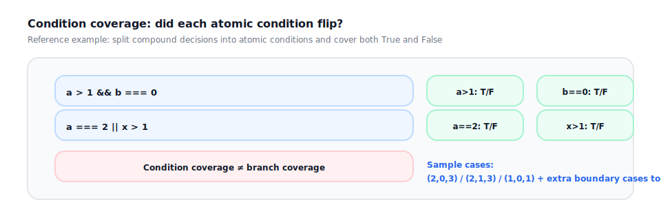
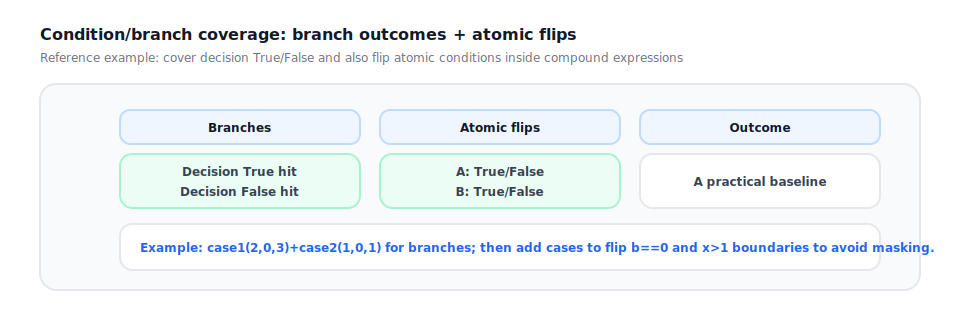
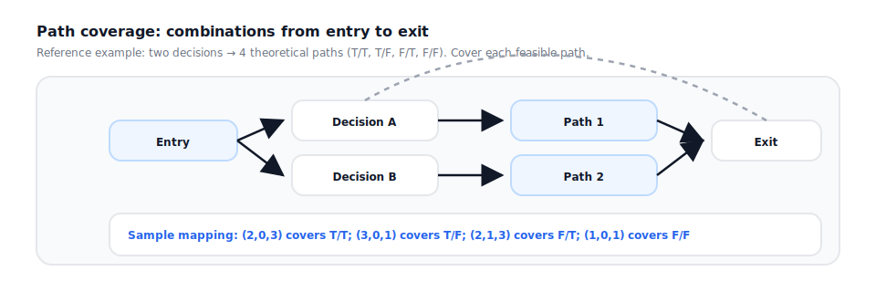
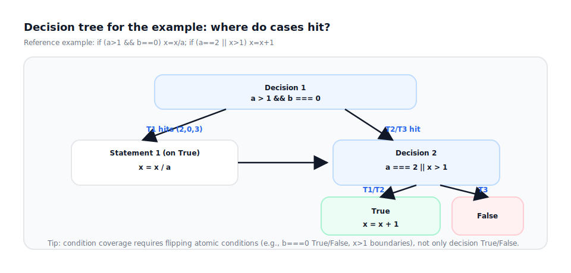

## Test Coverage

This page explains common coverage metrics, what they do and do not guarantee, and why “100% coverage” can still miss important logic.



### 1) Statement coverage



Definition: the percentage of executable statements that were executed.

Notes:
- Good at finding code that never runs, but it does not guarantee each decision outcome was validated.
- With branching logic, 100% statement coverage can still miss important branch outcomes.

### 2) Branch coverage



Definition: for each decision point (`if`, `switch`, etc.), each outcome (True/False or each `case`) is executed at least once.

Notes:
- Stronger than statement coverage for finding unexecuted branches.
- With compound conditions (`A && B`, `A || B`), branch coverage does not prove that each atomic condition meaningfully affects outcomes.

### 3) Condition coverage



Definition: each atomic condition inside a compound expression (e.g. `A`, `B`) takes both True and False at least once.

Notes:
- Focuses on flipping each atomic condition, but it does not guarantee all decision outcomes are covered.
- Commonly reviewed together with branch coverage.

### 4) Condition/branch coverage



Definition: both of the following hold:
- Branch coverage (each decision’s outcomes are covered)
- Condition coverage (each atomic condition flips to True and False)

Notes:
- A practical baseline for business validations implemented as compound conditions.
- Still not the same as path coverage (not all combinations / paths are guaranteed).

### 5) Path coverage



Definition: coverage of feasible execution paths from entry to exit (considering combinations of branches).

Notes:
- Theoretical strongest, but the number of paths can grow exponentially with branches/loops.
- In practice, teams usually cover critical paths + high-risk branches + boundary cases rather than enumerating all paths.

---

## Example: different “coverage” on the same code



Example code:

```ts
export function calcX(a: number, b: number, x: number) {
  if (a > 1 && b === 0) x = x / a;
  if (a === 2 || x > 1) x = x + 1;
  return x;
}
```

Decisions:
- Decision 1: `a > 1 && b === 0`
- Decision 2: `a === 2 || x > 1`

### A) A minimal set that achieves 100% branch coverage (illustrative)

| Case | a | b | x | Expected (returned x) | What it covers |
| --- | --- | --- | --- | --- | --- |
| T1 | 2 | 0 | 3 | 2 | Decision1=True, Decision2=True, both statements run |
| T2 | 2 | 1 | 3 | 4 | Decision1=False, Decision2=True, only `x=x+1` runs |
| T3 | 1 | 0 | 1 | 1 | Decision1=False, Decision2=False, no statements run |

This set typically achieves:
- High statement coverage
- Branch coverage for both decisions (True/False covered)

But it can still miss:
- Atomic flips inside compound conditions (e.g., `b===0` True/False), and boundary cases for `x>1`

### B) Making condition coverage meaningful: flip the atomic conditions

Add one more case:

| Case | a | b | x | Expected (returned x) | What it covers |
| --- | --- | --- | --- | --- | --- |
| T4 | 3 | 0 | 1 | 1.333... | Flips `a===2` to False while making `x>1` True (Decision2=True) |

This moves closer to condition/branch coverage: decision outcomes are covered, and atomic conditions are explicitly flipped.

### C) Why full path coverage is rarely achievable

As more decisions are added (states, permissions, external dependency switches), feasible paths explode. A better practical strategy is:
- Use scenarios as the backbone (critical paths)
- Split risky branches (auth/validation/errors/concurrency/idempotency) into independent cases
- Use matrices (decision/judgment) to make combinations explicit, then pick a minimal covering set
