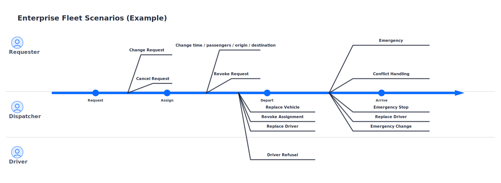

## Verification & Validation: the review loop

[English](../../en-US/theory/verification_and_validation.md) | [中文](../../zh-CN/theory/verification_and_validation.md) | [日本語](../../ja-JP/theory/verification_and_validation.md)

In visual-spec, Verification (build the right spec) and Validation (build the right thing) are different classes of problems. They require different evidence and different review styles.

### The difference

- Verification: are the specs consistent, complete, implementable, testable, and traceable
- Validation: does the solution satisfy user goals and business value, and do scenarios actually work end-to-end

### Standards background

Verification & Validation (V&V) is not unique to visual-spec. It is a widely used, standardized process in systems and software engineering. For reference, ISO/IEC 26551:2016 includes related practices that separate validation evidence (“are we building the right thing?”) from verification evidence (“are we building it right?”) to reduce late rework and spec drift.

### Roles and goals

In visual-spec, the typical roles and goals for each part of V&V are:

- Validation: primarily business stakeholders (product/ops/domain owners), with engineering/design participating
  - Goal: confirm scenarios and interactions match business expectations and user value; confirm scope is reasonable and deliverable
  - Evidence: runnable prototypes, scenario review entrypoints, walkthroughs of key paths, and recorded review conclusions
- Verification: primarily spec authors, engineering leads, and QA/test leads, with business stakeholders confirming semantics as needed
  - Goal: confirm specs are consistent, complete, implementable, testable, and traceable; prevent “described but not buildable/testable/aligned” gaps
  - Evidence: rule-based checks (`qc_report`), testability/traceability checks, and a fix backlog for omissions/contradictions

### The V&V process in visual-spec

1. Establish scope and shared language (`/vspec:new`)
   - Roles, terms, scenarios, flows, function list, dependencies, and open questions
2. Specify to implementation-ready granularity (`/vspec:detail`)
   - Produce traceable detailed specs
3. Validation (`/vspec:verify` + stakeholder review)
   - Validate behavior via runnable prototypes and scenario-based review entrypoints
   - In “Review & Confirmation”, explicitly define the scenario scope for this round (which scenarios are in/out), so the review has a clear conclusion
4. Verification (`/vspec:qc`)
   - Run rule-based checks to surface omissions, contradictions, non-testable specs, and missing traceability
5. Close the loop (`/vspec:refine`)
   - Apply review conclusions and QC fixes via refine inputs, regenerate downstream artifacts, then re-validate/re-check

### Why separate V from V

- Different evidence: validation needs runnable behavior; verification needs consistency and testability evidence
- Different reviewers: business stakeholders spot mismatches in scenarios/prototypes; engineering/QA spot gaps in specs and testability
- More actionable outcomes: scoping scenarios + refining changes turns feedback into trackable work
