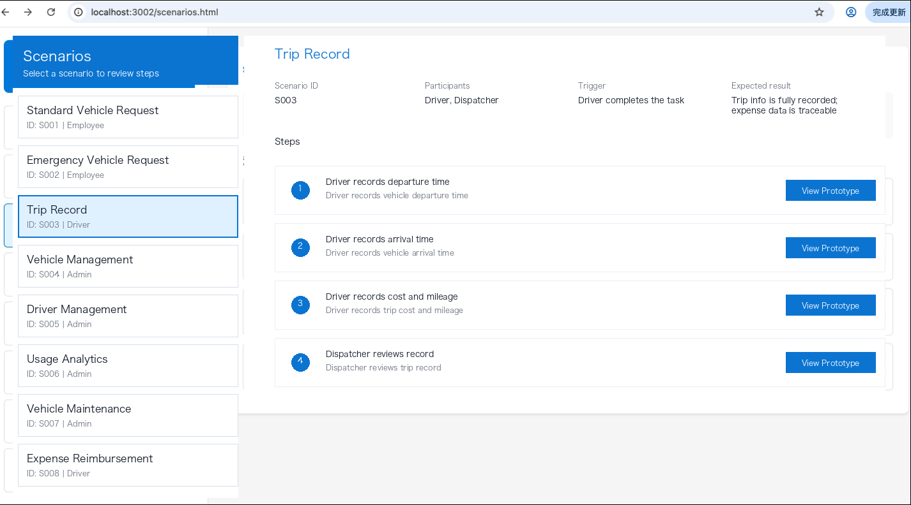

## Verification & Validation: the review loop

[English](../../en-US/theory/verification_and_validation.md) | [中文](../../zh-CN/theory/verification_and_validation.md) | [日本語](../../ja-JP/theory/verification_and_validation.md)

In visual-spec, Verification (build the right spec) and Validation (build the right thing) are different classes of problems. They require different evidence and different review styles.

### Reader navigation

- PMs / BAs: focus on “Roles and goals”, “The V&V process”, and “Close the loop”
- Developers / QA: focus on “The difference”, “Concrete examples”, “Verification checklist”, and the QC step in the process
- Tool customizers: see the fork guide for extending V&V/QC rules and prompts: [Fork guide](../../en-US/fork.md)

### The difference

- Verification: are the specs consistent, complete, implementable, testable, and traceable
- Validation: does the solution satisfy user goals and business value, and do scenarios actually work end-to-end

### Why “Scenario - Node - Function - Detail” is a great reading structure

- Scenario: start from business goals and user value. This is the best entry for Validation. Reviewing “do key scenarios work end-to-end?” yields fast, actionable conclusions.
- Node: break a scenario into a step chain. Feedback can land precisely on “which step is wrong / what’s missing”, instead of vague “the whole thing feels off”.
- Function: map nodes to the system’s function list (`/specs/functions`). This aligns “business steps” with “system capabilities” and makes cross-system dependencies explicit.
- Detail: drill each function down to implementable/testable specs (`/specs/details`) such as RBAC, data permissions, page load & interaction, service/job logic, etc. This supports Verification.
- The four layers form a natural traceability path: review from scenario → locate the node → map back to function list → drill down to the concrete detail docs. Changes and regression checks stay localized.

### Concrete examples (not generic statements)

- Example: your spec says “Task has a `priority` field”, but the generated model `/specs/models/task.md` omits `priority`  
  - Result: prototype / API / acceptance outputs cannot align on “priority” behavior, and the gap tends to surface late
  - With [/vspec:qc](../../../README.md#commands), the mismatch between “spec text” and “model content” becomes a visible, fixable issue

### Standards background

Verification & Validation (V&V) is not unique to visual-spec. It is a widely used, standardized process in systems and software engineering. For reference, ISO/IEC 26551:2016 includes related practices that separate validation evidence (“are we building the right thing?”) from verification evidence (“are we building it right?”) to reduce late rework and spec drift.

### Roles and goals

In visual-spec, the typical roles and goals for each part of V&V are:

- Validation: primarily business stakeholders (product/ops/domain owners), with engineering/design participating
  - Goal: confirm scenarios and interactions match business expectations and user value; confirm scope is reasonable and deliverable
  - Evidence: runnable prototypes, scenario review entrypoints, walkthroughs of key paths, and recorded review conclusions
- Verification: primarily spec authors, engineering leads, and QA/test leads, with business stakeholders confirming semantics as needed
  - Goal: confirm specs are consistent, complete, implementable, testable, and traceable; prevent “described but not buildable/testable/aligned” gaps
  - Evidence: rule-based checks (`qc_report`), testability/traceability checks, and a fix backlog for omissions/contradictions

### The V&V process in visual-spec

1. Establish scope and shared language ([/vspec:new](../../../README.md#commands))
   - Roles, terms, scenarios, flows, function list, dependencies, and open questions
2. Specify to implementation-ready granularity ([/vspec:detail](../../../README.md#commands))
   - Produce traceable detailed specs
3. Validation ([/vspec:verify](../../../README.md#commands) + stakeholder review)
   - Validate behavior via runnable prototypes and scenario-based review entrypoints
   - In “Review & Confirmation”, explicitly define the scenario scope for this round (which scenarios are in/out), so the review has a clear conclusion
4. Verification ([/vspec:qc](../../../README.md#commands))
   - Run rule-based checks to surface omissions, contradictions, non-testable specs, and missing traceability
5. Close the loop ([/vspec:refine](../../../README.md#commands))
   - Apply review conclusions and QC fixes via refine inputs, regenerate downstream artifacts, then re-validate/re-check

### Verification checklist (actionable)

- Every functional requirement has at least one acceptance criterion, mapped to scenarios/flows
- External dependencies are explicitly listed (systems/APIs/webhooks/topics/files) and traceable to scenarios/functions
- Data models have no undefined references: relations/foreign keys have clear sources, semantics, and constraints
- Key rules are testable: permissions, state machine, field validation, failure paths, idempotency/retry
- The [/vspec:qc](../../../README.md#commands) report has no CRITICAL issues, and each finding has a documented disposition (fixed / not-applicable / deferred with reason)

### Why separate V from V

- Different evidence: validation needs runnable behavior; verification needs consistency and testability evidence
- Different reviewers: business stakeholders spot mismatches in scenarios/prototypes; engineering/QA spot gaps in specs and testability
- More actionable outcomes: scoping scenarios + refining changes turns feedback into trackable work
