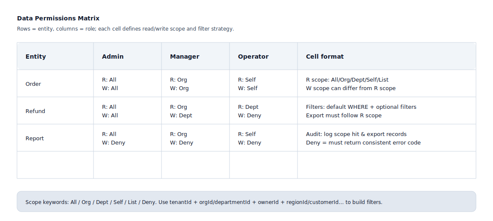

## Data Permissions

Used to make explicit "what data a role can see/operate under different data scopes", avoiding the situation where RBAC only solves "can click" but not "what data can be seen/modified".

Applicable Scenarios:
- Data isolation for multi-tenant/multi-org/multi-dept/multi-project/multi-region
- Data scope control by creator, affiliated org, business line, customer, region, or resource ownership

Common Data Scope Dimensions:
- Tenant: tenantId
- Organization: orgId / departmentId
- Ownership: ownerId / assigneeId / dispatcherId / driverId
- Region: regionId / cityCode / siteId
- Business Object: customerId / projectId / fleetId

Data Permissions Matrix Format (SVG Example):

