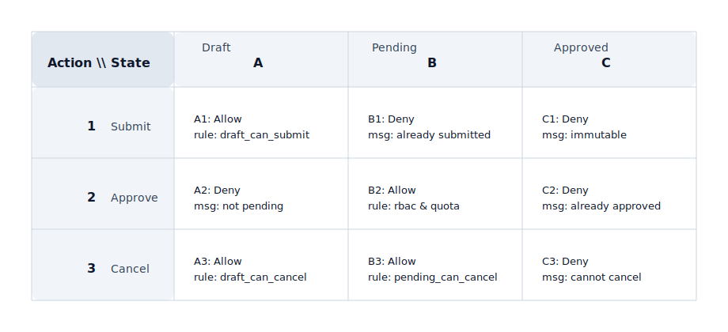

## Decision Matrix

Used to express "how to choose among multiple optional actions/strategies", emphasizing explainability: why choose A instead of B.

Applicable Scenarios:
- Routing strategies (automated vs. manual, which channel/vendor to use)
- Resource allocation (inventory allocation, quota allocation, queue priority)
- Degradation and fault tolerance (switching strategies after failure, retry/fallback)

Matrix Definition (Orthogonal Matrix):
- Horizontal axis: State, marked with letter coordinates: A / B / C ...
- Vertical axis: Action, marked with number coordinates: 1 / 2 / 3 ...
- Cells: The decision result and rule entry point when "State=Column" and "Action=Row"

Decision Matrix Example (SVG):

Coordinate-driven Rule Description (Use coordinates to reference logic instead of repeating texts):
- A1: State=Draft, Action=Submit → Allow; Rule entry: `draft_can_submit` (RBAC + field validation + idempotency check)
- B2: State=Pending, Action=Approve → Allow; Rule entry: `rbac & quota` (permission point + quota/limit + approval chain)
- C3: State=Approved, Action=Cancel → Deny; Reason: Cannot cancel after approval (unified error code and prompt)