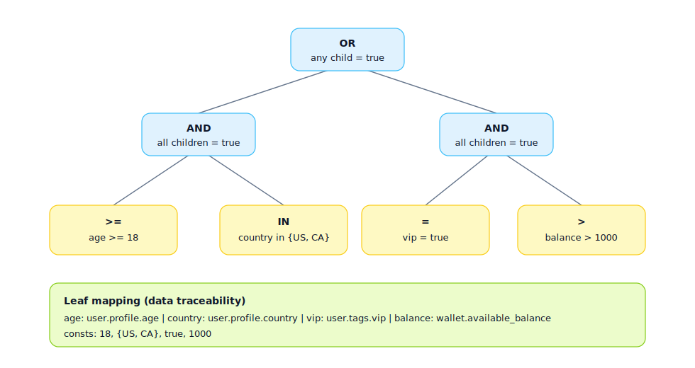

## Expression Tree

Used to express the "computable structure of complex conditions/formulas", breaking long conditions into reusable sub-expressions for easier implementation and testing.

Applicable Scenarios:
- Complex admission/risk conditions (deep AND/OR/NOT combinations)
- Billing/scoring/ranking formulas
- Permission judgments (role + data scope + state)

Role of Expression Tree:
- Make complex rules computable: break "long conditions/formulas" into a tree, recursively evaluating the tree structure during execution
- Make rules explainable: each node has explicit semantics, useful for logs, audits, error prompts, and backtracking
- Make rules reusable/testable: subtrees can be named and reused, with unit tests covering critical subtrees

Role of Nodes (Minimal Set):
- Operator Nodes: AND/OR/NOT, determining combinational logic and short-circuit strategies
- Comparison Nodes: = / != / > / >= / IN / LIKE, etc., comparing "field values" with "constants/other fields"
- Function Nodes: e.g., `contains` / `regex` / `abs` / `round` / `date_diff`, processing inputs into comparable values
- Leaf Nodes: Fields and Constants, providing traceable data sources

Expression Tree Example (SVG):

