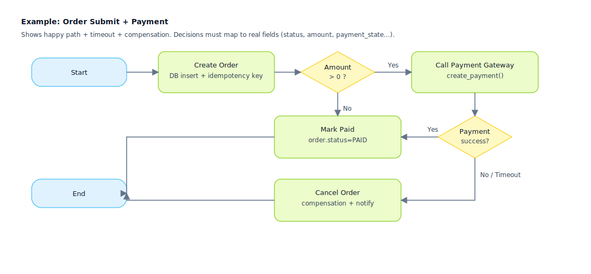

## Flowchart

Used to express "business steps and branches", focusing on Actions and Decisions, suitable for reviewing "whether the process is complete and branches are implementable".

Applicable Scenarios (when a flowchart must be drawn):
- When the main business process + exception/rollback processes need to be reviewed together (avoiding only happy paths)
- When branch conditions need to be mapped to implementable inputs like fields/states/permissions/quotas
- When control flows like timeouts, retries, compensations, manual interventions, and parallel convergences exist
- When "cross-system orchestration" needs to be clarified (calling external systems/queues/notifications/reconciliations)

Value of Expression (why draw it):
- Make branches implementable: every Decision maps to explicit field sources, avoiding "feel-based branching"
- Make responsibilities decomposable: every Action corresponds to page operations/APIs/tasks/messages, facilitating breakdown and estimation
- Make risks visible: timeouts, failures, retries, compensations, and idempotency points are visible on the chart, facilitating early design
- Make tests generatable: scenarios and test cases can be directly generated from node chains (main/exception/boundary paths)

Flowchart Example (SVG):

