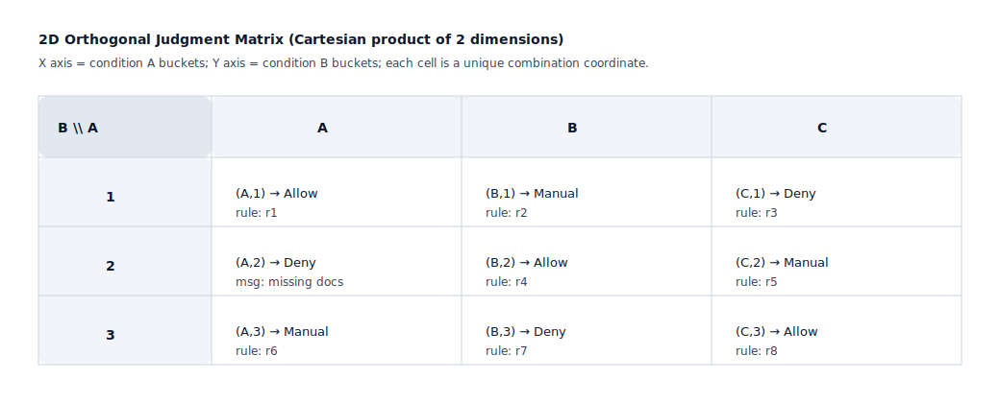
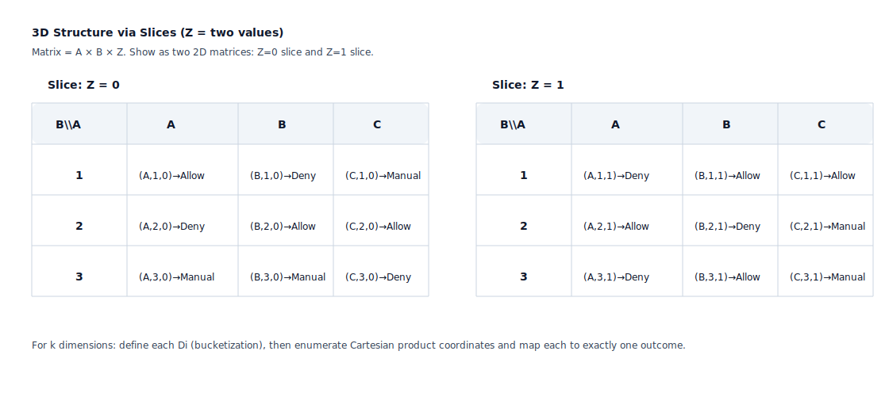

## Judgment Matrix

Used to make "condition combinations → judgment results" explicit, preventing implicit rules from being scattered in texts, facilitating review and test coverage.

Applicable Scenarios:
- Qualification/admission judgments (whether it can be applied/executed)
- Risk/compliance judgments (whether to block/transfer to manual/require supplementary materials)
- Billing/discount/settlement rules (rate selection, caps, tiers)

Mathematical Principle (Permutations and Combinations / Cartesian Product):
- A judgment matrix essentially enumerates the Cartesian product of "condition dimensions": `C = D1 × D2 × ... × Dk`
- Each dimension `Di` is a set of values for a key condition (enums/interval buckets/threshold segments/booleans)
- Total combinations: `|C| = Π |Di|` (combinations grow multiplicatively with more dimensions and values)
- Matrix purpose: maps each combination to a unique result `f(c) -> outcome`, making each outcome traceable to coordinates (combinations)

Value of Expression (why use a matrix):
- Visible coverage: which combinations are undefined and which use default fallbacks are clear at a glance
- Controllable conflicts: the same combination can only have one result; conflicts/priorities must be explicit
- Generatable test cases: each coordinate is an executable test input (can be sampled by risk or fully covered)

2D Orthogonal Matrix Format (SVG Example):

Multi-dimensional Judgment Matrix Structure (SVG Example: 3rd dimension uses "slices"):

Test Mapping:
- Each row/category of combinations should correspond to at least 1 acceptance test case