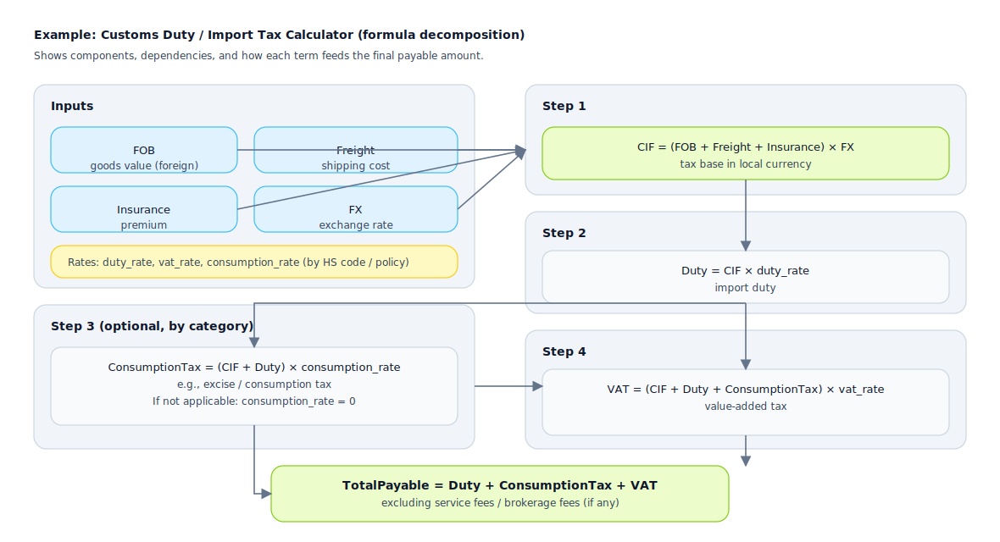

## Math Formulas

Used to clarify "computable rules" into symbolic expressions, filling in variable definitions, units, and boundary conditions to reduce implementation deviations.

Applicable Scenarios:
- Billing/discounts/apportionment/settlement
- Metric definitions (statistics, YoY/MoM, normalization, scoring)
- Risk scoring, threshold and weight models

Suggested Information to Include:
- Formula Body: variables, constants, functions
- Variable Definitions: source fields, units, precision, value ranges
- Boundaries and Exceptions: division by zero, null values, negative numbers, overflow, and rounding strategies
- Examples: provide a set of inputs and expected outputs as the acceptance test baseline

Complex Formula Example (SVG: Customs Duty and Tax Calculator)

