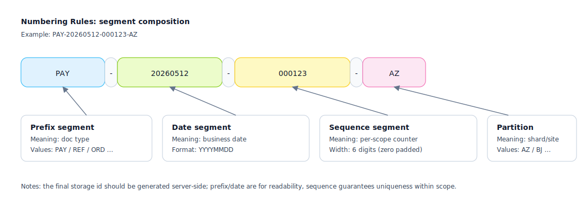

## Numbering Rules

Used to define the "unique ID generation strategy for documents/entities", ensuring they are traceable, reconcilable, and troubleshootable.

Applicable Scenarios:
- Business document numbers (application form/order/refund slip)
- Reconciliation batch numbers, import batch numbers, task execution batch numbers

Suggested Information to Include:
- Format: prefix/date/sequence/segmentation rules (e.g., `PAY-20260512-000123`)
- Generation Timing: generated upon creation / upon approval / upon external callback
- Concurrency and Deduplication: Snowflake / DB sequence / distributed segments
- Readability and Sensitive Info: avoid leaking user privacy and business secrets

Numbering Example (SVG):

