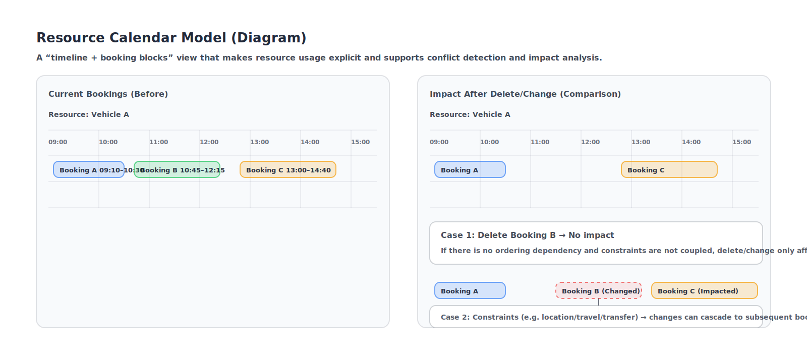

The resource calendar model describes “how a resource can be used within a time range”. It uses bookings on a timeline to represent availability, occupancy, and constraints, supporting scheduling, dispatching, conflict detection, and emergency adjustments.

## Basic Concepts

- Resource: an allocatable/schedulable object, e.g. vehicles, drivers, dispatchers, meeting rooms, production lines, devices.
- Time window: the definition of a resource’s available/unavailable/occupied state within a period.
- Booking: a record that “locks” a resource in a time window, usually linked to a business document or task.
- Constraints: limits that determine feasibility, e.g. maximum continuous work hours, required rest, region/location constraints, travel/transfer time.

## Core Ideas

- Resource calendar = default availability + exceptions + bookings + constraints.
- “Available” is not a static conclusion; it is determined by the time window, booking conflicts, and constraints together.

## Suggested Fields (Example)

- id: calendar model id
- resourceType: resource type (vehicle/driver/dispatcher/...)
- resourceId: unique resource identifier
- timeZone: time zone
- weeklyAvailability: weekly repeating default availability
- exceptions: date-specific exceptions (holidays, temporary unavailability, temporary overtime)
- bookings: existing bookings (start/end, linked document, booking type)
- constraints: constraint rule set (optional)
- updatedAt: last update time

## Impact of Deleting/Changing a Booking

When deleting or changing a booking, the impact depends on whether bookings have dependencies and constraint coupling.

- No impact: other bookings have no time conflicts and there is no ordering dependency or shared constraints.
- Small impact: re-run conflict detection for the same resource to ensure subsequent bookings are still feasible.
- Large impact: cascading changes due to constraints, for example:
  - Location/travel: if A is in downtown and C is in the suburbs, changing B’s time/location can break reachability and force C to shift or use another resource.
  - Ordering dependency: later bookings depend on completion of earlier ones (e.g. return trip required before next order, changeover required before next batch).
  - Rules/regulations: driver working hours, mandatory rest, maintenance windows, etc.

## Common Uses

- Conflict detection: check interval conflicts against existing bookings and exceptions.
- Impact analysis: when changing time/people/origin/destination, evaluate whether vehicle/driver still satisfy availability and constraints.
- Cancellation/emergency adjustment: on revoke dispatch, emergency stop, emergency change, roll back or reschedule related bookings.

## Applicable Scenarios

- Dispatching/scheduling: vehicles and drivers are typical resources; orders are bookings; location and travel are key constraints.
- Flight delays: flights/crew/gates are resources; delays shift bookings and cause cascading impacts on flight chains and crew duty limits.
- Factory scheduling: production lines/equipment/molds are resources; work orders are bookings; changeover, maintenance windows, and material arrival are common constraints.
