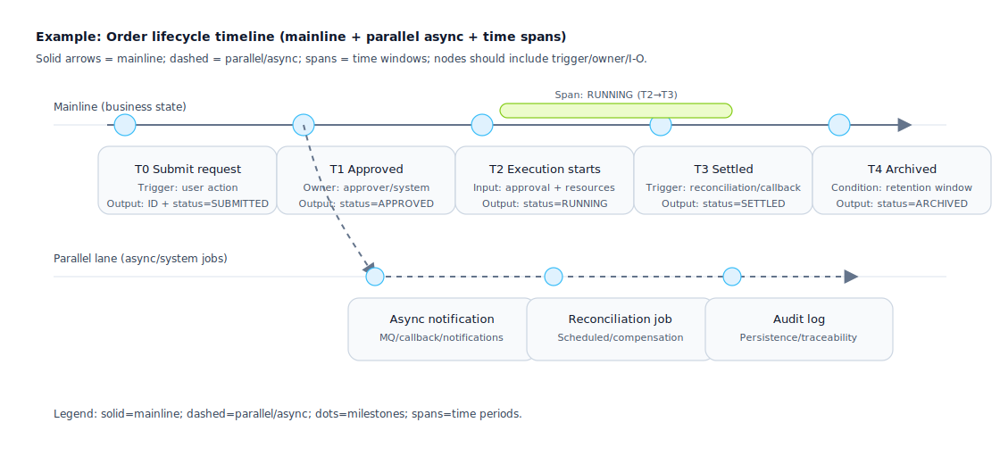

## Timeline

Used to express "the sequence, dependencies, and parallel relationships of events over time". It turns narrative into a checkable structure, and clarifies each stage’s inputs/outputs, ownership boundaries, and fallback strategies.

Why timelines matter:
- Make reviews checkable: for each node, verify trigger, prerequisites, persistence points, outputs, ownership, and failure handling.
- Make parallelism explicit: approval/execution/notification/reconciliation/compensation often run in parallel; plain text hides critical dependencies.
- Unify the story: align state changes, flowcharts, APIs, scheduled jobs, and MQ/callback timing into one view.
- Support testing and operations: timelines map naturally to test cases (preconditions/trigger/expected/timeout) and to monitoring/SLA/retry/compensation.

Applicable scenarios:
- Business lifecycle (Application → Approval → Execution → Reconciliation/Settlement → Archiving)
- State evolution and key milestones (Start/Pause/Rollback/Terminate)
- Version release rhythm, canary, rollback windows, data migration windows

Use with care / not ideal when:
- Logic is mainly branching decisions: use flowcharts/judgment matrices for conditions and branches; keep the timeline to key events only.
- You only need data structure definition: use data models/field specs instead.

Suggested information to include:
- Time Points/Periods: trigger conditions, prerequisites, output results
- Participating Roles: who triggers/who approves/who executes/who monitors
- Risk Points: failure fallbacks, compensation paths, timeout strategies

Suggested output formats:
- Linear Timeline (single main thread)
- Branching Timeline (parallel/fork/merge)

## Lines and lanes

Mainline (solid):
- The primary causal chain of business state changes. Each node should map to at least one checkable artifact: a status field update, a persisted record, an external call result, or an observable event.

Parallel/async (dashed):
- For MQ, callbacks, scheduled jobs, compensation tasks, audit logs, notifications, and other side-chains triggered by the mainline.
- Always indicate the source mainline node to avoid “tasks appearing out of nowhere”.

Dependencies (prefer node annotations over too many crossing edges):
- Describe dependencies as node metadata (e.g., “Prereq: T1 Approved”, “Depends on: payment_id exists”) to reduce visual noise.

Time spans (bars/spans):
- For “ongoing states/windows” (RUNNING, canary window, reconciliation window, freeze window, cancellation window).
- Spans must have start/end boundaries and an exit condition (event/timeout/manual confirmation).

## What a node should contain

Minimum set (every node should answer):
- Trigger: what/who triggers it (user action/system job/callback/MQ)
- Prereq: required conditions/dependencies (data exists/approved/stock locked)
- Action: what happens (persist/call/change state/publish message)
- Output: what is produced (status/ID/voucher/message/file)

Recommended set (for testability and operability):
- Ownership: owner (role/system) and failure ownership (who handles it)
- Idempotency/dedup: idempotency key, dedup strategy, expected behavior on retries
- Timeout: wait window and timeout handling (retry/compensation/manual intervention)
- Observability: logs/metrics/alerts (business ID, trace_id, key fields)

## “Should this be a node?” checklist

Make importance checkable:
- Must include: changes business state, produces externally visible output, introduces irreversible cost (charge/ship/redeem), affects downstream branching.
- Should include: async waiting/retry steps, human approval steps, cross-system calls (including callbacks).
- Can omit but explain: pure UI rendering details, pure refresh, low-risk steps inferable from context.

## Common pitfalls

- Only “what happened” without trigger/prereq/output → cannot write tests.
- Async tasks without a source node, or without an end condition.
- Spans labeled “running” without entry/exit conditions and timeout strategy.
- Overdrawing dependencies with crossing lines: prefer node-level prereq metadata.
