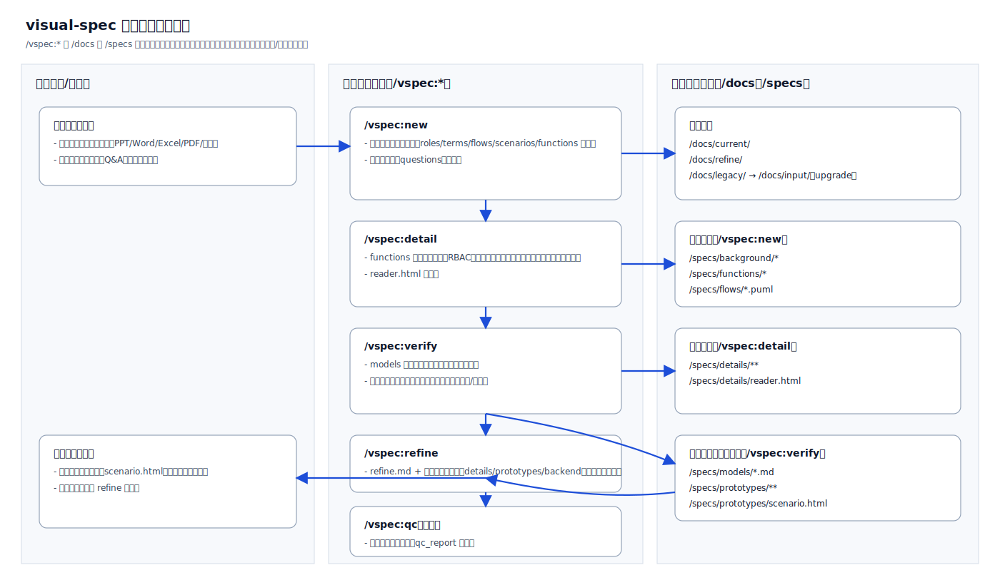

## Theory（設計理念）

[English](../en-US/theory.md) | [中文](../zh-CN/theory.md) | [日本語](../ja-JP/theory.md)

本セクションでは、visual-spec Skill の設計理念を説明します。SDLC（ソフトウェア開発ライフサイクル）との対応関係、なぜコマンドを段階に分けているのか、なぜ「シナリオ一覧」を HTML で出力してプロトタイプと連動させるのか、そして `/vspec:new` が多面的に分析する理由を整理します。

### ワークフロー（可視化）

### 目次

- SDLC 対応：段階設計の意図と SDLC とのマッピング  
  - [theory/sdlc.md](theory/sdlc.md)
- レビュー最適化：なぜ HTML のシナリオ一覧なのか、なぜプロトタイプ連動がレビューに効くのか  
  - [theory/prototype-review.md](theory/prototype-review.md)
- `/vspec:new` が多くを分析する理由と、出力が後続ステップでどう再利用されるか  
  - [theory/new-analysis.md](theory/new-analysis.md)
- 分析思考：要件分析を再利用可能なモジュールとして分解する  
  - [theory/thinking-framework.md](theory/thinking-framework.md)

### 要約

visual-spec は、要件を「追跡可能でレビュー可能なデリバリーの鎖」に変換するために設計されています。シナリオを背骨として、ロール・ルール・データモデル・実行可能プロトタイプを接続し、実装前の合意形成と、変更時の下流成果物の同期更新を容易にします。
