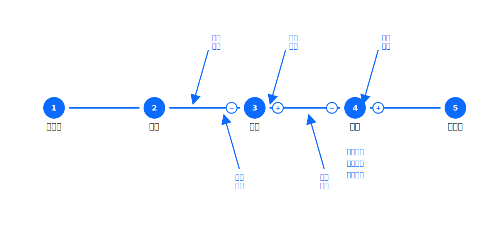
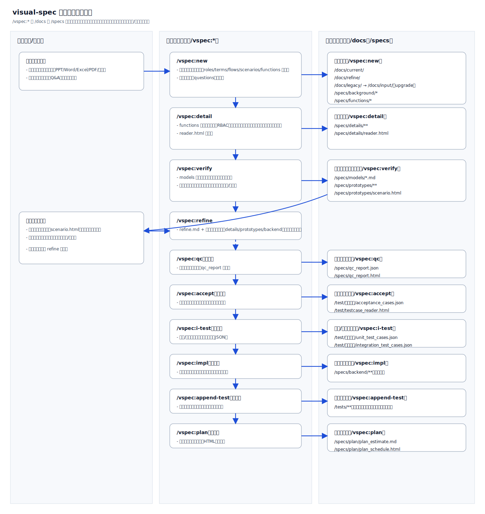
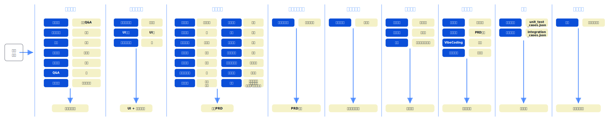
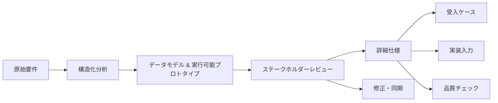

## Theory（設計理念）

[English](../en-US/theory.md) | [中文](../zh-CN/theory.md) | [日本語](../ja-JP/theory.md)

本セクションでは、visual-spec Skill の設計理念を説明します。SDLC（ソフトウェア開発ライフサイクル）との対応関係、なぜコマンドを段階に分けているのか、なぜ「シナリオ一覧」を HTML で出力してプロトタイプと連動させるのか、そして [/vspec:new](../../README.md#commands) が多面的に分析する理由を整理します。

また、承認/回付型のフローを 1 つの再利用可能な骨格（flows）に正規化し、分析出力を安定させるための抽象化も採用しています。

この図はプロンプトのチェックリストとして使います。業務を 1〜5 のステップに割り当て、取消/却下などの制御パスと、実行に必要な制約（検証・上限・冪等など）を明示することで、仕様と受入ケースを同じ構造で揃えられます。

### ワークフロー（可視化）

### ステージマップ

この図は、分析のステージと典型的な入力/出力を対応付けたものです。レビューでは「今どの段階にいて、次に何を埋めるべきか」を合意しやすくなります。

### なぜ visual-spec なのか

従来の PRD/仕様書は、だいたい同じ失敗パターンに収束します。

- 認識ズレ：曖昧さが実装/結合/受入のタイミングまで露見しない
- フィードバックの遅さ：関係者が「触って理解」できる成果物が出るのが遅い
- 変更の混乱：要求変更で原型/用例/実装メモが同期せず、下流が漂流する

visual-spec はこれを左シフトします。要件を「追跡可能でレビュー可能で検証可能な成果物の連鎖」に変換し、実装前に合意形成と検証を終えるための設計です。

### コアワークフロー（理念の着地）

要点は、構造化 → 実行可能な検証 → 詳細化 → 受入と実装入力 → 品質チェックと変更同期です。

コマンドと成果物の対応：

- 構造化：[/vspec:new](../../README.md#commands) が `/specs/` に基礎成果物（ロール/用語/flows/シナリオ/機能一覧/未解決事項など）を作る
- 検証：[/vspec:verify](../../README.md#commands) がデータモデルと実行可能プロトタイプ、HTML のシナリオ評審入口を生成（典型は `/specs/models/`、`/specs/prototypes/`）
- 詳細化：[/vspec:detail](../../README.md#commands) が機能一覧を実装可能な仕様へ落とす（典型は `/specs/details/`）
- 受入と実装入力：[/vspec:accept](../../README.md#commands) が受入ケース（JSON：`/test/验收用例/acceptance_cases.json`）と `/test/testcase_reader.html` を出力し、[/vspec:impl](../../README.md#commands) が技術スタックに沿った実装入力を出す
- 品質と変更：[/vspec:qc](../../README.md#commands) が QC レポートを出し、[/vspec:refine](../../README.md#commands) が canonical requirement を更新して下流成果物を同期する

### 主要な設計判断（なぜこの形か）

- レビュー最適化：実行可能プロトタイプ + HTML のシナリオ入口で、非技術ステークホルダーも参加しやすく、フィードバックが早い
- モデル優先：用語/状態/制約を先に固め、UI での言い換えや状態追加による手戻りを減らす
- 変更に強い：`/specs/` を 1 つの canonical requirement から派生する成果物集合として扱い、[/vspec:refine](../../README.md#commands) で源泉を更新し下流を同期する
- 実行可能な品質：主観レビューではなく、[/vspec:qc](../../README.md#commands) で欠落/矛盾/検証不能点を機械的に露出させる

### ステージマップ（Command → Outputs → V&V 観点）

| ステージ | コマンド | 入力 | 主な出力（典型パス） | V&V 観点 |
| --- | --- | --- | --- | --- |
| 1. 構造化 | [/vspec:new](../../README.md#commands) | 原始要件 | `/specs/` の基礎成果物 | 網羅性：ロール/制約/例外/未解決事項 |
| 2. 検証 | [/vspec:verify](../../README.md#commands) | 機能一覧 + シナリオ | `/specs/models/`、`/specs/prototypes/`（HTML 入口含む） | 正しさ：シナリオと制約に一致するか |
| 3. 詳細化 | [/vspec:detail](../../README.md#commands) | 検証結果 | `/specs/details/` | 整合性：権限/検証/境界条件が揃うか |
| 4. 受入 | [/vspec:accept](../../README.md#commands) | シナリオ + 詳細仕様 | `/test/验收用例/acceptance_cases.json` | 受入可能性：重要分岐と高リスクを覆うか |
| 5. 実装入力 | [/vspec:impl](../../README.md#commands) | 詳細仕様 + リポジトリ制約 | `/specs/backend/`（有効時）など | 実装可能性：実スタック/規約に沿うか |
| 6. QC | [/vspec:qc](../../README.md#commands) | `/specs/` 全量 | `/specs/qc_report.json`、`/specs/qc_report.html` | 交付可能性：欠落/矛盾が露出しているか |
| 7. 変更同期 | [/vspec:refine](../../README.md#commands) | 変更/フィードバック | `original.md` 更新 + 下流同期 | 追跡性：変更が帰因され伝播するか |
| 8. 計画 | [/vspec:plan](../../README.md#commands) | スコープ + 制約 | `/specs/plan/plan_estimate.md`、`/specs/plan/plan_schedule.html` | 計画可能性：分解と範囲が評審可能か |

### 追加の読み物（ライフサイクル順）

| テーマ | ドキュメント | 対象 |
| --- | --- | --- |
| SDLC 対応 | [theory/sdlc.md](theory/sdlc.md) | PM / Tech Lead |
| [/vspec:new](../../README.md#commands) の分析次元 | [theory/new-analysis.md](theory/new-analysis.md) | BA / PM |
| 分析思考 | [theory/thinking-framework.md](theory/thinking-framework.md) | BA / PM |
| 思考モード（閉ループ含む） | [theory/thinking-modes.md](theory/thinking-modes.md) | 全員 |
| ステークホルダー識別 | [theory/stakeholder-identification.md](theory/stakeholder-identification.md) | BA / PM |
| 抽象（flows） | [theory/abstraction.md](theory/abstraction.md) | BA / Tech Lead |
| シナリオ分岐 | [theory/scenarios.md](theory/scenarios.md) | BA / PM / QA |
| レビュー最適化（原型連動） | [theory/prototype-review.md](theory/prototype-review.md) | PM / 関係者 |
| 読みやすさ（分層読書） | [theory/reading-experience.md](theory/reading-experience.md) | 全員 |
| Verification & Validation | [theory/verification_and_validation.md](theory/verification_and_validation.md) | QA / Tech Lead |
| テストカバレッジ | [theory/test-coverage.md](theory/test-coverage.md) | QA / Dev / Tech Lead |
| 受入テスト（シナリオ駆動） | [theory/acceptance.md](theory/acceptance.md) | QA / Dev / PM |
| 品質チェック | [theory/quality_check.md](theory/quality_check.md) | 全員 |
| 計画と見積 | [theory/planning.md](theory/planning.md) | PM |

### 要約

visual-spec は、要件を「追跡可能でレビュー可能なデリバリーの鎖」に変換するために設計されています。シナリオを背骨として、ロール・ルール・データモデル・実行可能プロトタイプを接続し、実装前の合意形成と、変更時の下流成果物の同期更新を容易にします。
