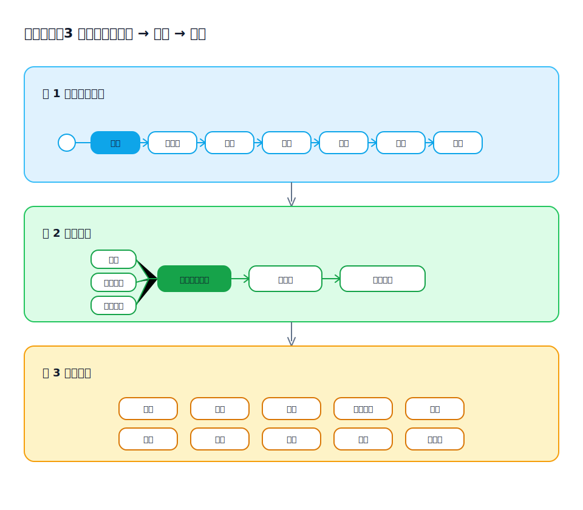

## 読みやすさ（Reading Ergonomics）：分層読書で要件理解を速くする

[English](../../en-US/theory/reading-experience.md) | [中文](../../zh-CN/theory/reading-experience.md) | [日本語](../../ja-JP/theory/reading-experience.md)

要件の理解が遅い原因は、情報不足というより「読みの摩擦」であることが多いです。早い段階から細部に入り込むと、読者は全体像を頭の中で組み立てる必要があり、認知負荷が急増します。

visual-spec は成果物を分層で読める形に整理し、まず端から端までの流れで共通理解を作り、必要な箇所だけ実装可能・検証可能な詳細へ下りられるようにします。

### 1) 3 層の読み：プロセス → 構造 → 詳細

分層は「章立て」ではなく「理解の導線」です。

- 第 1 層：全体業務プロセス（主経路 + 重要な分岐）
- 第 2 層：プロセスノードの構成構造（何で構成され、入出力が何で、どう繋がるか）
- 第 3 層：構成要素の詳細仕様（実装・検証可能な粒度）

第 3 層には通常、原型の振る舞いと UI 交互、バリデーション、権限/データ権限、業務ルールと状態遷移、例外/境界、ログ/通知などが含まれます。

HTML で成果物を提供しリンクで繋ぐと、この 3 層は「跳べる読書導線」になります。

- 第 1 層（プロセス図/シナリオ一覧）から、議論対象のノード/シナリオを選ぶ
- 第 2 層へ跳んで、ノードの構造（入力・操作・状態変化・出力）を確定する
- 第 3 層へ要素単位で下りる（原型ページ、バリデーション/権限/ルール/状態の仕様）
- 上位層へ戻り、文脈を失わずに次の論点へ進む

### 2) 同じ成果物で「各取所需」になり、説明の重複が減る

- 事業/企画：第 1〜2 層で流れの正しさと抜けを確認
- 開発：第 2〜3 層で実装可能性とルール/権限/バリデーションの精度を確認
- QA/受入：第 3 層を実行可能な観点（前提、手順、期待結果、分岐）へ落とす

### 3) 長文の線形叙事より、リンク可能な構造化オブジェクト

成果物が増えるほど、線形ドキュメントは探索が難しく、変更でズレやすくなります。情報を構造化オブジェクト（プロセスノード、シナリオ、ルール、フィールド、状態、ページ）に紐付けることで：

- 議論の定位が速い
- ルールの再利用がしやすい
- 変更時の取りこぼしが減る

### 4) HTML の跳躍読書 vs Word の線形読書

規模が大きい場合（シナリオ/ページ/ルールが多い）、速度は「答えへ跳べるか」に依存します。

- HTML は非線形ナビゲーションに強い：目次、アンカー、クロスリンクで導線を即時に組み替えられる  
  - シナリオ一覧 → ノード → 原型ページ/ルール/データ定義へ跳ぶ
  - 指摘をリンク先に固定でき、「何ページのどこ」の曖昧さを減らせる
  - 上位層＝ナビ、下位層＝説明/検証という分層に自然に合う
- Word は線形叙事に強い：通読向きだが、高頻度の往復参照はコストが上がりやすい  
  - ルール ↔ 原型 ↔ データ定義の対照は、移動が手作業になりがち

### 5) 結果

分層読書は内容を分割することが目的ではなく、理解プロセスを成果物として設計することが目的です。まず全体像を揃え、リンクで必要な詳細を素早く閉じることで、合意形成とレビューを加速します。
