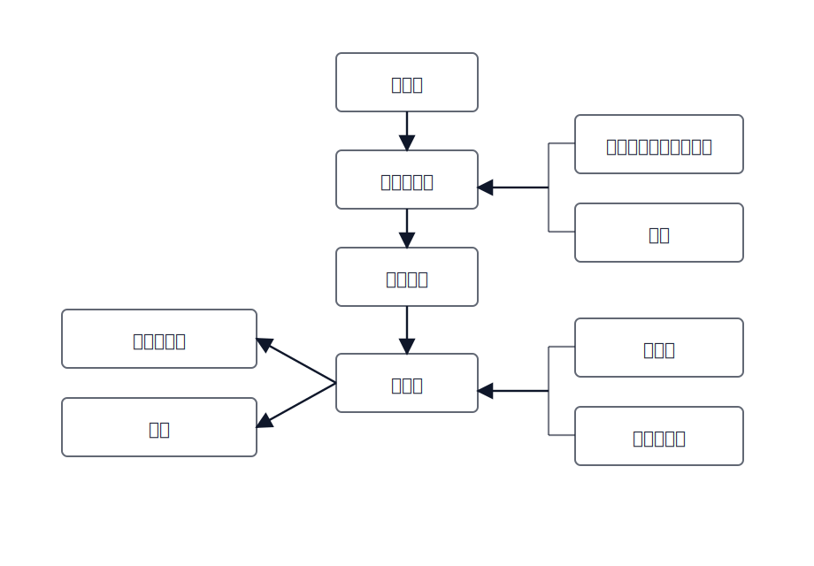

## ステークホルダー識別の思考法

[English](../../en-US/theory/stakeholder-identification.md) | [中文](../../zh-CN/theory/stakeholder-identification.md) | [日本語](../../ja-JP/theory/stakeholder-identification.md)

目的はロール名を並べることではなく、なぜステークホルダー識別が重要で、どんな価値があるかを明確にすることです。

同じ要件でも、ステークホルダーが変わると見え方が変わります。価値と境界を重視する人もいれば、ルールとリスク、運用コストと保守性、体験と可用性を重視する人もいます。これらの視点を早い段階で会話に乗せることで、要件をより網羅的にし、実装可能性を高め、「誰かが抜けていた／重要な制約が漏れていた」という後戻りを減らせます。

そのため「要件はどこから来るか／誰が決めるか／誰が実行するか／誰が影響を受けるか／制約はどこから来るか」を構造化して表現し、特定の層や部門だけで口径が固まってしまうのを防ぎます。

### 1) 組織の主経路：意思決定から利用まで

図の縦方向（経営層 → 中間管理職 → 現場管理 → 利用者）は、組織内の「意思決定 → 管理への落とし込み → 実行 → 利用」の主経路です。

- 経営層：方向性と境界（目標、コンプライアンス、投資上限）を決め、重要な取捨選択を最終決定します。
- 中間管理職：目標をルールと指標に翻訳します（プロセス定義、承認ルール、配分方針）。
- 現場管理：日々の実行を担い（割当、例外処理、運用定着）、暗黙ルールの主要な供給源になります。
- 利用者：実際の操作主体／被提供者であり、UI・効率・体験の制約を規定します。

矢印は口径とルールが下流へ伝播することを示します。レビューでは各層が参加しているか、最低限カバーできているかを確認します。

### 2) 要件の出どころとサービス対象：顧客は両方

左側の「要件伝達者」「顧客」から「利用者」へ矢印が向いているのは、要件が最終利用者から直接出てくるとは限らないことを示しています。

- 要件伝達者：現場の痛みを代理で伝える人（運用、CS、導入等）。事例と制約を持ち込みますが偏りも起きるため、利用者での再検証が必要です。
- 顧客：購入/契約主体。要件の出どころであるだけでなく、システムのサービス対象でもあります。契約スコープや受入基準を規定しつつ、提供品質や満足度の観点でも「成功」を定義します。優先順位だけでなく、サービス結果として成立しているかも合わせて検証します。

### 3) 制約と脇影響：コンプラ/顧問/他部門/第三者

右側の括弧は、主経路にいないが制約・レビュー・依存として強く影響する関係者のまとまりです。

- コンプライアンス部門 + 顧問（括弧）→ 中間管理職：制度や監査要件は「ルールと口径」に作用し、実行可能なフローと監査点へ翻訳されます。
- 他部門 + 第三者企業（括弧）→ 利用者：連携や外部依存は「実行と利用」の層で顕在化します（API、引継ぎ、SLA、障害連携）。

### `/vspec:new` での落とし込み

- 主経路と脇影響の両方を baseline 成果物（stakeholders/roles）に記録し、各ステークホルダーに「関心事・制約・決裁権限・検証口径」を紐付けます。
- 「誰が何を決めるか」を Open Questions と意思決定リスト（誰がルール確認、誰がコンプラ確認、誰が受入確認）に変換し、意思決定不在による手戻りを防ぎます。
