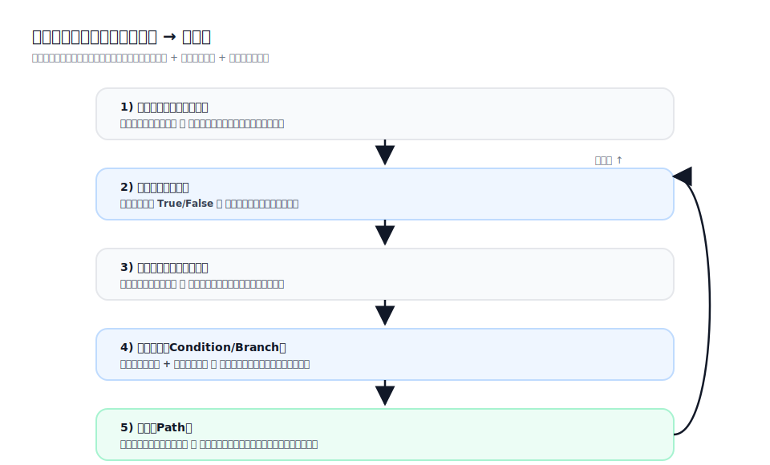
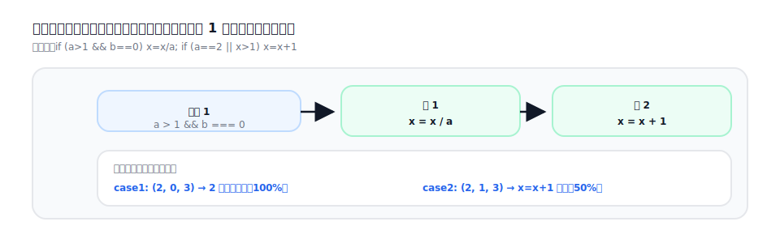
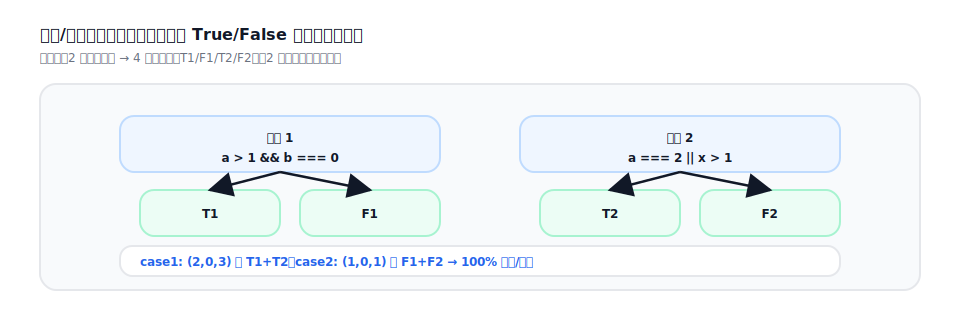
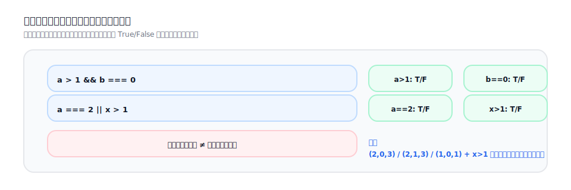
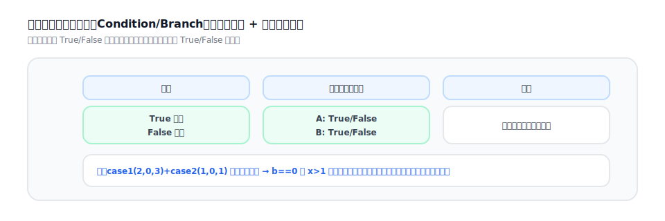
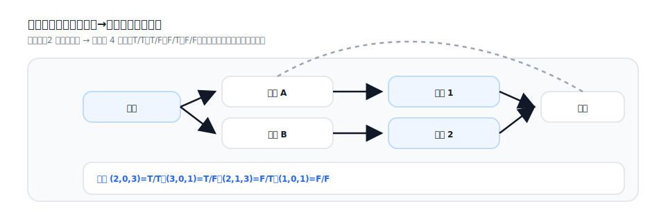
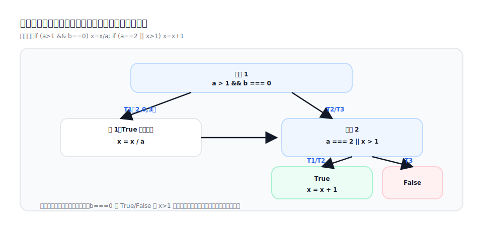

## テストカバレッジ（Test Coverage）

本ページでは、代表的なカバレッジ指標の意味と限界を整理し、同じコード例で「100% カバレッジでもロジック漏れが起きる」ことを説明します。



### 1) 命令（ステートメント）カバレッジ



定義：実行可能な文（ステートメント）が実行された割合。

ポイント：
- 「そもそも実行されていないコード」を見つけやすい一方、分岐の結果が十分検証されたとは限りません。
- 分岐を含む場合、命令カバレッジ 100% でも重要な分岐結果を取りこぼすことがあります。

### 2) 分岐（ブランチ）カバレッジ



定義：各判定点（`if`、`switch` など）について、各分岐（True/False や各 `case`）が少なくとも 1 回は実行されること。

ポイント：
- 命令カバレッジより「未実行の分岐」を見つけやすいです。
- 複合条件（`A && B`、`A || B`）では、分岐カバレッジだけでは各原子条件の影響を十分に検証できません。

### 3) 条件カバレッジ



定義：複合条件式内の各原子条件（例：`A`、`B`）が、それぞれ True と False を取ること。

ポイント：
- 各条件を「反転」させることに焦点を当てますが、判定点全体の True/False を必ずしも保証しません。
- 実務では分岐カバレッジと合わせて見ることが多いです。

### 4) 条件分岐カバレッジ（Condition/Branch Coverage）



定義：以下の両方を満たすこと。
- 分岐カバレッジ（各判定点の True/False を網羅）
- 条件カバレッジ（各原子条件が True/False を網羅）

ポイント：
- 複合条件で実装される業務バリデーションにおいて、実用的なベースラインになります。
- それでもパスカバレッジ（全経路網羅）と同義ではありません。

### 5) パスカバレッジ



定義：入口から出口までの「実行可能な経路（分岐の組合せ）」の網羅度。

ポイント：
- 理論上は最も強いですが、分岐/ループが増えると経路数が指数的に増え、完全網羅は現実的でないことが多いです。
- 実務では「重要経路 + 高リスク分岐 + 境界条件」で代替します。

---

## 例：同じコードでも、指標が違えば意味が違う



例のコード：

```ts
export function calcX(a: number, b: number, x: number) {
  if (a > 1 && b === 0) x = x / a;
  if (a === 2 || x > 1) x = x + 1;
  return x;
}
```

判定点：
- 判定 1：`a > 1 && b === 0`
- 判定 2：`a === 2 || x > 1`

### A) 分岐カバレッジ 100% の最小セット（例）

| ケース | a | b | x | 期待値（返る x） | カバー内容 |
| --- | --- | --- | --- | --- | --- |
| T1 | 2 | 0 | 3 | 2 | 判定1=True、判定2=True、2つの文が実行 |
| T2 | 2 | 1 | 3 | 4 | 判定1=False、判定2=True、`x=x+1` のみ実行 |
| T3 | 1 | 0 | 1 | 1 | 判定1=False、判定2=False、どの文も実行されない |

このセットで達成しがちなもの：
- 高い命令カバレッジ
- 判定 1/2 の分岐（True/False）を網羅

ただし、次のような取りこぼしがあります：
- 複合条件内の原子条件（例：`b===0`）の True/False 反転、`x>1` の境界

### B) 条件を「反転」させて、条件カバレッジを意味あるものにする

追加で 1 ケース：

| ケース | a | b | x | 期待値（返る x） | カバー内容 |
| --- | --- | --- | --- | --- | --- |
| T4 | 3 | 0 | 1 | 1.333... | `a===2` を False にしつつ `x>1` を True にして判定2=True を検証 |

これにより、分岐網羅に加えて原子条件の反転も確認でき、条件分岐カバレッジに近づきます。

### C) なぜパスカバレッジは完全網羅しづらいのか

判定点（状態、権限、外部依存のスイッチなど）が増えるほど経路が爆発します。実務では次が有効です：
- シナリオを主線にする（重要経路）
- 高リスク分岐（認可/検証/例外/並行/冪等）を独立ケース化する
- 決定行列/判定行列で組合せを可視化し、最小の網羅セットを選ぶ
