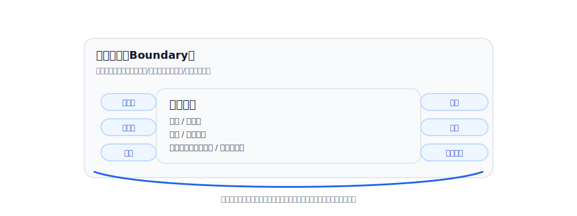
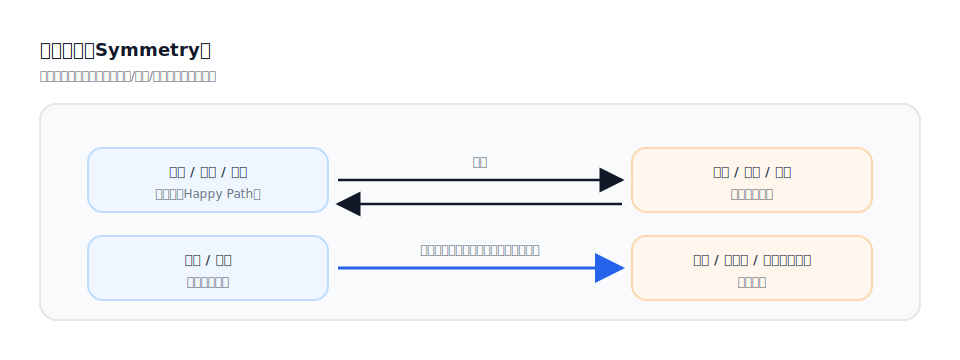
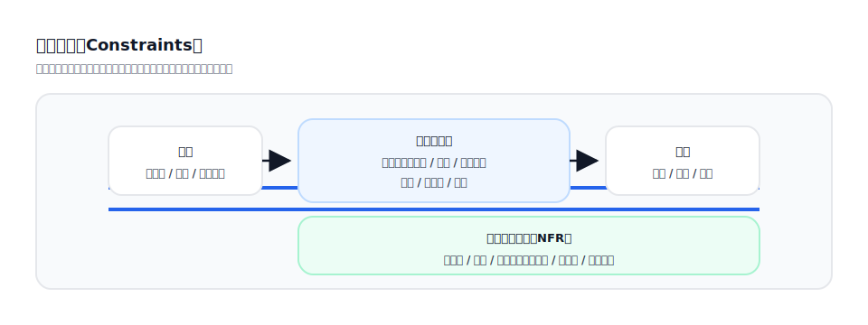
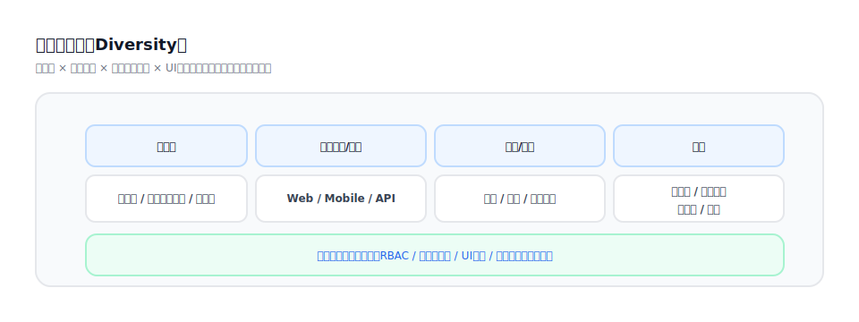
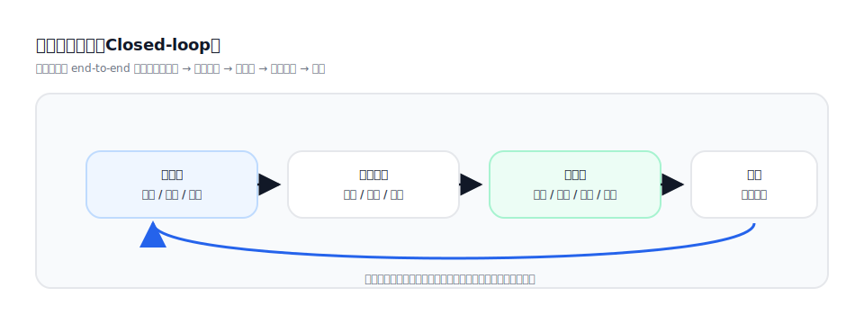
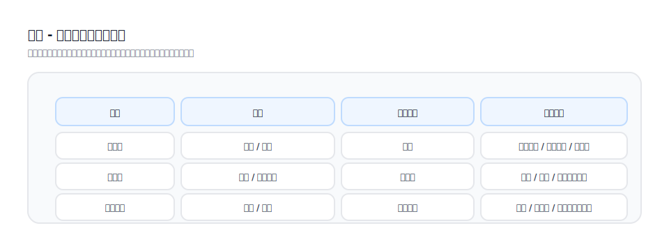

## `/vspec:new` の分析思考：境界 / 対称 / 制約 / 多様性

[English](../../en-US/theory/thinking-modes.md) | [中文](../../zh-CN/theory/thinking-modes.md) | [日本語](../../ja-JP/theory/thinking-modes.md)

本ドキュメントは、`/vspec:new` が自然言語要件をレビュー可能で落とし込みやすい成果物へ変換する際に用いる代表的な思考法をまとめます。テンプレートではなく、欠落・矛盾・意思決定ポイントを発見するための道具です。

### 1) 境界思考（Boundary）

- スコープ/非スコープ、適用範囲、境界条件を明確化
- ロール/データ/時間/組織/権限の境界を特定

### 2) 対称思考（Symmetry）

- 主経路から逆方向/補償を導出する
- 「作成」を「変更/取消/ロールバック/取消（逆仕訳）/返金」に対称化
- 「成功」を「失敗/再試行/冪等/重複送信」に対称化

### 3) 制約思考（Constraints）

- 暗黙制約を明示：バリデーション、認可、状態機械、データ口径
- システム制約を明示：信頼性、監査、コンプライアンス、追跡性、アラート

### 4) 多様性思考（Diversity）

- ロール/シナリオ/チャネル/端末/組織/運用モードの差分を網羅
- 特にダッシュボード/プロトタイプはロール差分に注意する

### 5) 閉ループ思考（Closed-loop）

業務要件は「いちばん重要な部分」だけに焦点が当たりやすく、前後が抜けがちです。

- 前処理：主要アクションの前に必要な条件、データ準備、認可、バリデーション、初期化
- 後処理：アクション後に必要な状態同期、通知、ログ、照合/補償、そして「完了条件」

閉ループ思考は、点で書かれた要件を end-to-end の閉ループへ拡張し、前処理と後処理を必ず分析対象に含めるための思考法です。これにより、実装や受入の段階で大きな穴が露出するのを防ぎます。

典型質問：

- 「この操作の前提条件は何か？満たさない場合はどうなるか？」
- 「成功/失敗の後に、システムは何をしなければならないか？」
- 「プロセスが本当に終わったと判断する根拠は？（非同期通知、再試行、補償、照合など）」

### 6) 行動 - コース対応表（分析結果の例）

コース型プロダクトでは、要件が「コース/学習」を中心に書かれ、コースを成立させる具体的な行動が抜けがちです。「行動 - コース」の対応表を作ると、入口、権限、バリデーション、状態変化の抜けを早く発見できます。

例（抜粋）：

| 対象（コース/レッスン） | 行動（ユーザー/システム） | 期待される状態変化 | 重点仕様 |
| --- | --- | --- | --- |
| コース | 閲覧/検索 | なし | フィルタ、並び替え、可視性ルール |
| コース | 購入/受講登録 | 受講中 | 決済、冪等、アクセス制御 |
| レッスン | 再生/一時停止/シーク | 進捗更新 | 進捗口径、レート制限、不正対策 |
| レッスン | 完了 | 完了 | 完了判定、再試行、オフライン同期 |
| コース | 証明書発行 | 発行済み | 資格ルール、監査、通知 |
