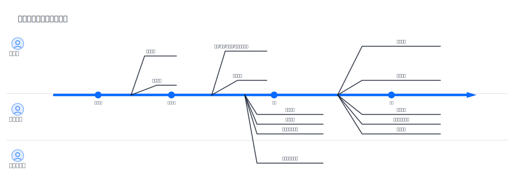

## Verification & Validation：検証と妥当性確認の閉ループ

[English](../../en-US/theory/verification_and_validation.md) | [中文](../../zh-CN/theory/verification_and_validation.md) | [日本語](../../ja-JP/theory/verification_and_validation.md)

visual-spec では、Verification（仕様として正しいか）と Validation（作るべきものか）は別の問題です。必要な証拠とレビュー方法が異なります。

### 読者ナビ

- PM/BA： 「実行役割と目的」「V&V の流れ」「閉ループ」
- 開発/QA： 「2 つの違い」「具体例」「Verification チェックリスト」「流れの QC」
- ルール拡張/カスタマイズ：V&V/QC のルールやプロンプトを拡張する方法は Fork ガイドを参照：[Fork guide](../../ja-JP/fork.md)

### 2 つの違い

- Verification：仕様が整合し、漏れがなく、実装可能で、テスト可能で、追跡可能か
- Validation：ユーザー価値と目的に合い、シナリオが end-to-end で成立するか

### 具体例（抽象論ではなく）

- 例：「Task には `priority` がある」と仕様に書いているのに、生成されたモデル `/specs/models/task.md` に `priority` が存在しない  
  - 結果：プロトタイプ/API/受入で “priority” の挙動が揃わず、実装段階で齟齬が噴出しやすい
  - [/vspec:qc](../../../README.md#commands) により「仕様の記述」と「モデルの内容」の不一致を、修正可能な指摘として可視化できる

### 標準化の背景

Verification & Validation（V&V）は visual-spec 固有の概念ではなく、システム/ソフトウェア工学で広く使われる標準的なプロセスです。参考として ISO/IEC 26551:2016 に関連する実践があり、Validation（作るべきものか）と Verification（正しく作れているか）を分けて証拠とレビューを組み立てることで、手戻りや口径漂移を減らします。

### 実行役割と目的

visual-spec の文脈では、V&V の主な実行役割と目的は次のとおりです。

- Validation（妥当性確認）：主に業務側（プロダクト/運用/ドメインオーナー）、開発/デザインが参加
  - 目的：シナリオと交互が業務期待・ユーザー価値に合うか、スコープが妥当で交付可能かを確認する
  - 証拠：実行可能プロトタイプ、シナリオのレビュー入口、重要経路の walkthrough、レビュー結論
- Verification（検証）：主に仕様作成者、開発リード、QA/テストリード（必要に応じて業務側が口径確認）
  - 目的：仕様の整合性/完全性/実装可能性/テスト可能性/追跡可能性を確認し、穴を早期に潰す
  - 証拠：ルールベースチェック（qc_report）、可測性/追跡性のチェック項目、漏れ/矛盾の修正バックログ

### visual-spec における V&V の流れ

1. 範囲と共通言語の確立（[/vspec:new](../../../README.md#commands)）
   - 役割、用語、シナリオ、フロー、機能一覧、依存、要確認事項
2. 実装可能粒度への仕様化（[/vspec:detail](../../../README.md#commands)）
   - 追跡可能な詳細仕様を作る
3. Validation（[/vspec:verify](../../../README.md#commands) + 関係者レビュー）
   - 実行可能プロトタイプとシナリオ入口で、期待どおりに動くかを確認する
   - 「レビューと確定」で対象シナリオ範囲を明確化し、今回のレビュー/受入で何を確認するかを確定する
4. Verification（[/vspec:qc](../../../README.md#commands)）
   - ルールベースで漏れ/矛盾/テスト不能/追跡不足を洗い出す
5. 閉ループ（[/vspec:refine](../../../README.md#commands)）
   - レビュー結論と QC の修正点を refine 入力に落とし、下流成果物を同期更新し、再検証する

### Verification チェックリスト（実行可能）

- すべての機能要件に、少なくとも 1 つの受入基準（Acceptance Criteria）があり、シナリオ/フローへ紐づく
- 外部依存が明示されている（システム/API/webhook/topic/ファイル）かつ、シナリオ/機能へ追跡可能
- データモデルに未定義参照がない（関連/外部キーの出所、口径、制約が定義済み）
- 重要ルールがテスト可能（権限、状態機械、入力バリデーション、失敗分岐、冪等/再試行）
- [/vspec:qc](../../../README.md#commands) レポートに CRITICAL がなく、各指摘に結論（修正/非対象/延期と理由）が残っている

### なぜ V と V を分けるのか

- 証拠が違う：Validation は動作の証拠、Verification は整合性とテスト可能性の証拠が必要
- レビュアーが違う：業務側はシナリオ/プロトタイプでズレを見つけやすく、開発/QA は仕様と可測性で欠落を見つけやすい
- 結論が実行可能になる：対象範囲を切り、refine で反映することで、フィードバックが追跡可能な作業に変わる
