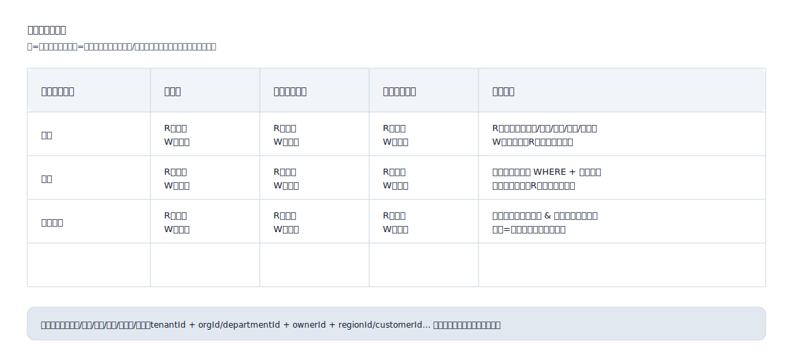

## データ権限 (Data Permissions)

「同じロールが異なるデータスコープでどのデータを表示/操作できるか」を明示的にするために使用され、RBACが「クリックできるかどうか」しか解決せず、「どのデータを表示/変更できるか」を解決しない状況を回避します。

適用シナリオ:
- マルチテナント/マルチ組織/マルチ部門/マルチプロジェクト/マルチリージョンのデータ分離
- 作成者、所属組織、ビジネスライン、顧客、地域、またはリソースの所有権によるデータスコープ制御

一般的なデータスコープのディメンション:
- テナント: tenantId
- 組織: orgId / departmentId
- 所有権: ownerId / assigneeId / dispatcherId / driverId
- 地域: regionId / cityCode / siteId
- ビジネスオブジェクト: customerId / projectId / fleetId

データ権限マトリックス形式 (SVGの例):

