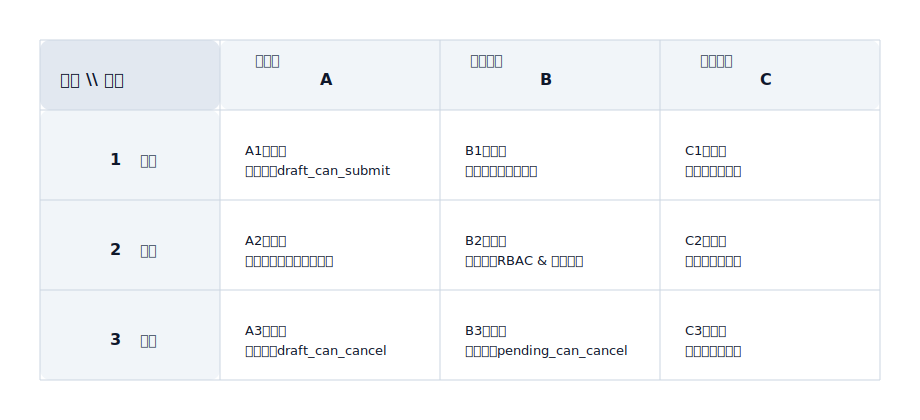

## 決定マトリックス (Decision Matrix)

「複数のオプションのアクション/戦略からどのように選択するか」を表現するために使用され、なぜBではなくAを選択するのかという説明責任を強調します。

適用シナリオ:
- ルーティング戦略 (自動化するか手動か、どのチャネル/ベンダーを使用するか)
- リソース割り当て (在庫割り当て、クォータ割り当て、キューの優先順位)
- 劣化とフォールトトレランス (障害後の戦略の切り替え、再試行/フォールバック)

マトリックスの定義 (直交マトリックス):
- 横軸: 状態 (State)、文字座標でマーク: A / B / C ...
- 縦軸: アクション (Action)、数字座標でマーク: 1 / 2 / 3 ...
- セル: 「状態=列」および「アクション=行」の場合の決定結果とルールエントリ

決定マトリックスの例 (SVG):

座標駆動のルール記述 (テキストを繰り返すのではなく、座標を使用してロジックを参照します):
- A1: 状態=Draft、アクション=Submit → 許可。ルールエントリ: `draft_can_submit` (RBAC + フィールド検証 + べき等性チェック)
- B2: 状態=Pending、アクション=Approve → 許可。ルールエントリ: `rbac & quota` (権限ポイント + クォータ/制限 + 承認チェーン)
- C3: 状態=Approved、アクション=Cancel → 拒否。理由: 承認後はキャンセルできません (統一されたエラーコードとプロンプトテキスト)