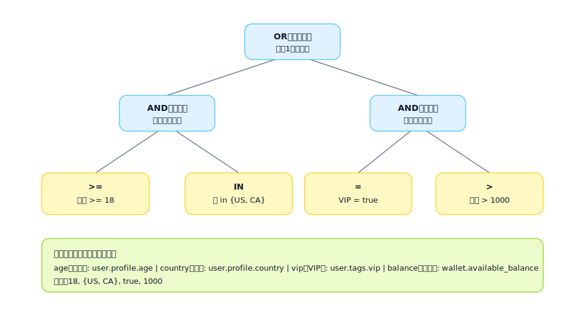

## 式ツリー (Expression Tree)

「複雑な条件/式の計算可能な構造」を表現するために使用され、長い条件を再利用可能な部分式に分割して、実装とテストを容易にします。

適用シナリオ:
- 複雑な入場/リスク条件 (深いAND/OR/NOTの組み合わせ)
- 課金/スコアリング/ランキングの式
- 権限の判定 (ロール + データスコープ + ステータス)

式ツリーの役割:
- 複雑なルールを計算可能にする: 「長い条件/長い式」をツリーに分割し、実行時にツリー構造を再帰的に評価します
- ルールを説明可能にする: 各ノードには明確なセマンティクスがあり、ログ、監査、エラープロンプト、およびバックトラッキングに役立ちます
- ルールを再利用/テスト可能にする: サブツリーに名前を付けて再利用し、重要なサブツリーをカバーする単体テストを実行できます

ノードの役割 (最小セット):
- 演算子ノード: AND/OR/NOT。組み合わせのロジックと短絡戦略を決定します
- 比較ノード: = / != / > / >= / IN / LIKE など。「フィールド値」と「定数/他のフィールド」を比較します
- 関数ノード: `contains` / `regex` / `abs` / `round` / `date_diff` など。入力を比較可能な値に処理します
- リーフノード: フィールドと定数。追跡可能なデータソースを提供します

式ツリーの例 (SVG):

