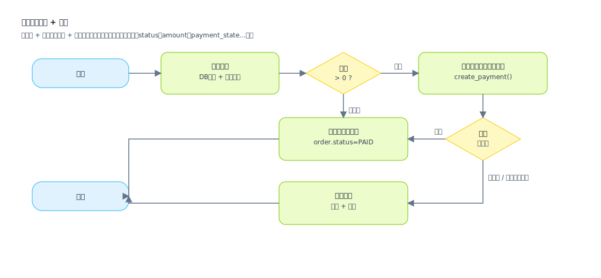

## フローチャート (Flowchart)

「ビジネスステップとブランチ」を表現するために使用され、アクションと決定に焦点を当てており、「プロセスが完全で、ブランチが実装可能かどうか」をレビューするのに適しています。

適用シナリオ (フローチャートを描画する必要がある場合):
- 主要なビジネスプロセス + 例外/ロールバックプロセスを一緒にレビューする必要がある場合 (ハッピーパスのみを回避する)
- ブランチ条件を、フィールド/状態/権限/クォータなどの実装可能な入力にマッピングする必要がある場合
- タイムアウト、再試行、補償、手動介入、並列コンバージェンスなどの制御フローが存在する場合
- 「クロスシステムオーケストレーション」を明確にする必要がある場合 (外部システム/キュー/通知/照合の呼び出し)

表現の価値 (なぜ描画するのか):
- ブランチを実装可能にする: すべての決定は明示的なフィールドソースにマップされ、「感覚に基づくブランチ」を回避します
- 責任を分解可能にする: すべてのアクションは、ページ操作/API/タスク/メッセージに対応しており、分解と見積もりを容易にします
- リスクを可視化する: タイムアウト、失敗、再試行、補償、およびべき等性ポイントがチャート上に表示され、早期の設計を容易にします
- テストを生成可能にする: シナリオとテストケースは、ノードチェーンから直接生成できます (メイン/例外/境界パス)

フローチャートの例 (SVG):

