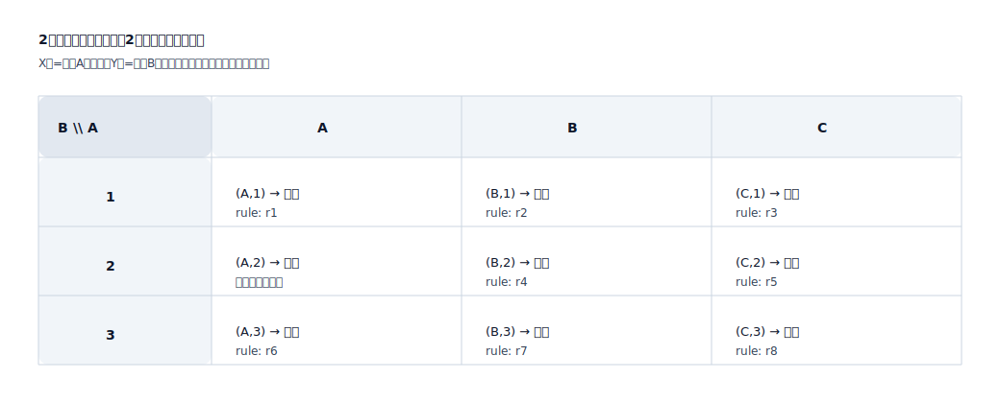
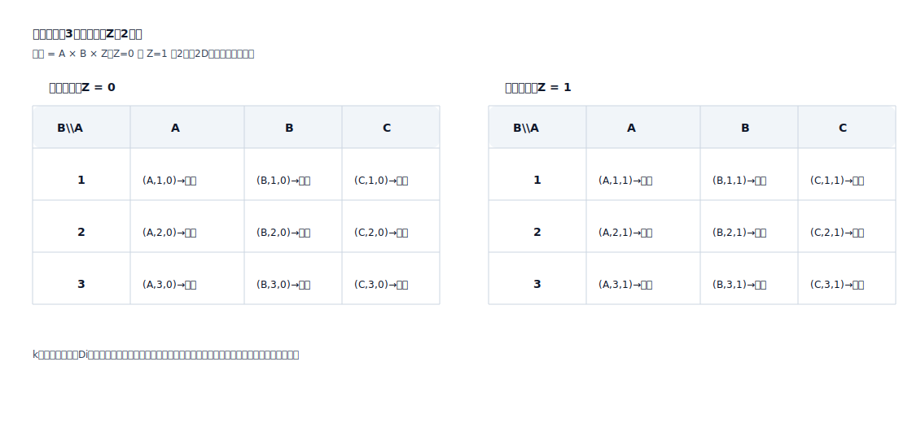

## 判定マトリックス (Judgment Matrix)

「条件の組み合わせ → 判定結果」を明示的にするために使用され、暗黙のルールがテキストに散在するのを防ぎ、レビューとテストカバレッジを容易にします。

適用シナリオ:
- 資格/入場判定 (適用可能か/実行可能か)
- リスク/コンプライアンス判定 (ブロックするか/手動に転送するか/補足資料を要求するか)
- 課金/割引/決済ルール (レートの選択、上限、階層)

数学的原理 (順列と組み合わせ / デカルト積):
- 判定マトリックスは、本質的に「条件ディメンション」のデカルト積を列挙します: `C = D1 × D2 × ... × Dk`
- 各ディメンション `Di` は、主要な条件の値のセット (列挙/間隔バケット/しきい値セグメント/ブール値) です。
- 合計の組み合わせ: `|C| = Π |Di|` (ディメンションと値が増えると、組み合わせは乗法的に増加します)
- マトリックスの目的: 各組み合わせを一意の結果 `f(c) -> outcome` にマッピングし、各結果を座標 (組み合わせ) まで追跡可能にします。

表現の価値 (なぜマトリックスを使用するのか):
- 可視化されたカバレッジ: どの組み合わせが未定義であり、どの組み合わせがデフォルトのフォールバックを使用するかが一目でわかります。
- 制御可能な競合: 同じ組み合わせには1つの結果しか持たせることができません。競合/優先順位は明示的である必要があります。
- 生成可能なテストケース: 各座標は実行可能なテスト入力です (リスクによってサンプリングするか、完全にカバーすることができます)。

2D直交マトリックス形式 (SVGの例):

多次元判定マトリックス構造 (SVGの例: 3番目のディメンションは「スライス」を使用):

テストマッピング:
- 組み合わせの各行/カテゴリは、少なくとも1つの受け入れテストケースに対応している必要があります。