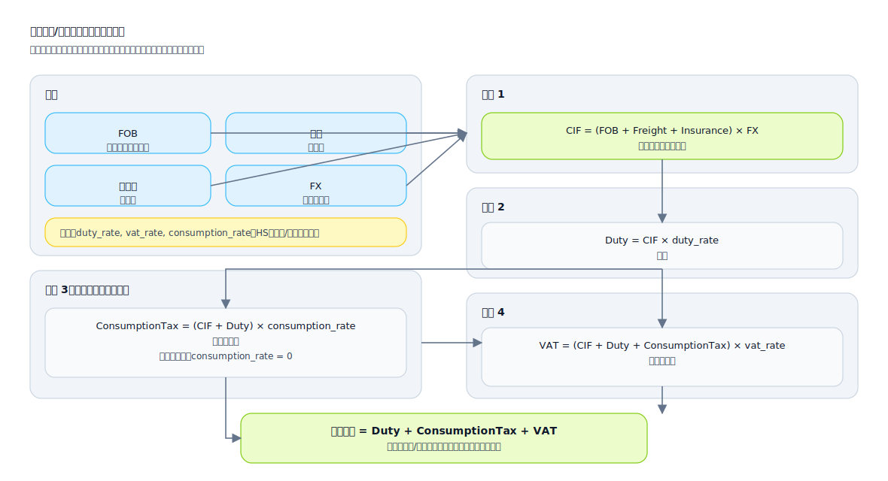

## 数式 (Math Formulas)

「計算可能なルール」を記号表現に明確化し、変数定義、単位、境界条件を補足して、実装の偏差を減らすために使用されます。

適用シナリオ:
- 課金/割引/配分/決済
- メトリクスの定義 (統計、前年比/前月比、正規化、スコアリング)
- リスクスコアリング、しきい値、および重みモデル

推奨される情報:
- 式の本体: 変数、定数、関数
- 変数の定義: ソースフィールド、単位、精度、値の範囲
- 境界と例外: ゼロ除算、NULL値、負の数、オーバーフロー、および丸め戦略
- 例: 受け入れテストのベースラインとして、入力と期待される出力のセットを提供します

複雑な式の例 (SVG: 税関の関税と税金の計算機)

