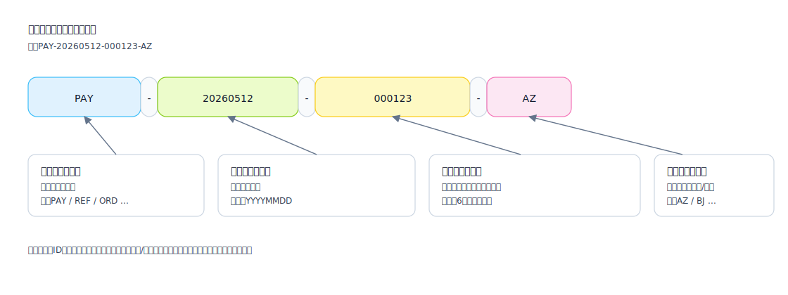

## 番号付けルール (Numbering Rules)

追跡可能、照合可能、トラブルシューティング可能であることを保証するために、「ドキュメント/エンティティの一意のID生成戦略」を定義するために使用されます。

適用シナリオ:
- ビジネスドキュメント番号 (申請書/注文書/返金伝票)
- 照合バッチ番号、インポートバッチ番号、タスク実行バッチ番号

推奨される情報:
- 形式: プレフィックス/日付/シーケンス/セグメンテーションルール (例: `PAY-20260512-000123`)
- 生成タイミング: 作成時に生成 / 承認時に生成 / 外部コールバック時に生成
- 同時実行と重複排除: Snowflake / データベースシーケンス / 分散セグメント
- 可読性と機密情報: ユーザーのプライバシーやビジネス上の機密情報の漏洩を回避します

番号付けの例 (SVG):

