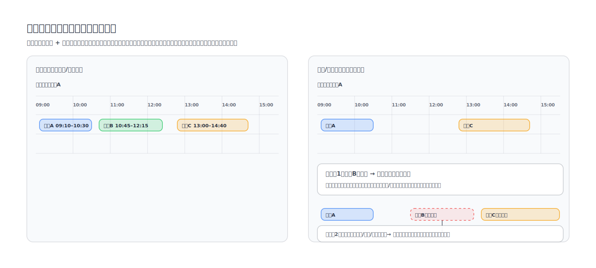

リソースカレンダーモデルは、「リソースが一定期間内にどのように使用できるか」を表し、時間軸上の占有率を使用してリソースの可用性、占有率、制約を表現し、スケジューリング、配車、競合の検出、緊急調整などのシナリオをサポートします。

## 基本概念

- リソース: 車両、ドライバー、配車担当者、会議室、生産ライン設備など、割り当て/スケジュールできるオブジェクト。
- タイムウィンドウ: 一定期間内のリソースの利用可能/利用不可/占有ステータスの定義。
- 占有 (booking): 特定のタイムウィンドウでリソースを「ロック」する記録。通常は特定のビジネスドキュメントまたはタスクに関連付けられています。
- 制約: 占有の実現可能性の制限条件。たとえば、最大連続稼働時間、必須の休憩期間、地域/場所の制限、接続/移動時間など。

## コアコンセプト

- リソースカレンダー = デフォルトの可用性 + 例外 + 占有 + 制約。
- リソースが「利用可能」かどうかは、静的な結論ではなく、タイムウィンドウ、占有の競合、および制約によって共同で決定される結果です。

## 推奨フィールド (例)

- id: カレンダーモデルID
- resourceType: リソースタイプ (vehicle/driver/dispatcher/...)
- resourceId: リソースの一意の識別子
- timeZone: タイムゾーン
- weeklyAvailability: 週単位で繰り返されるデフォルトの利用可能時間
- exceptions: 特別な日付の例外 (休日、一時的に利用不可、一時的な残業)
- bookings: 占有記録 (開始/終了、関連ドキュメント、占有タイプ)
- constraints: 制約ルールのセット (オプション)
- updatedAt: 最終更新時間

## 占有の削除/変更の影響

占有を削除または変更した場合の影響範囲は、占有間に「依存関係」と「制約の結合」が存在するかどうかによって異なります。

- 影響なし: 他の占有は、この占有と時間の競合がなく、順序の依存関係や共有の制約もありません (たとえば、同じリソースですが、占有が隣接しておらず、移動/接続を考慮する必要がありません)。
- 影響が小さい: 同じリソースで再度競合検出を実行して、その後の占有が引き続き実現可能であることを確認するだけで済みます。
- 影響が大きい: 連鎖的な調整を引き起こす制約要因が存在します。たとえば:
  - 場所/移動: 占有Aは都市部にあり、その直後に郊外にある占有Cが続きます。占有Bの時間または場所が変更されると、アクセシビリティが変更され、Cを延期するかリソースを変更する必要があります。
  - 順序の依存関係: 後続の占有は、前の占有の完了に依存します (たとえば、次の注文は往路の後にのみ実行でき、次のバッチは設備のライン切り替え後にのみ生産できます)。
  - 規制/ルール: ドライバーの労働時間、必須の休憩、生産ラインのメンテナンスウィンドウなどにより、1つの変更で複数のリスケジューリングがトリガーされます。

## 一般的な使用法

- 競合の検出: 新しい配車/変更と、既存のbookings、exceptionsとの間の時間間隔の競合判定。
- 影響分析: 時間/人数/出発地/目的地を変更する際に、車両とドライバーが引き続きavailabilityとconstraintsを満たしているかどうかを評価します。
- 取り消し/緊急調整: 割り当ての取り消し、緊急停止、または緊急変更を行う際に、関連するbookingsをロールバックまたはリスケジュールします。

## 適用シナリオ

- 配車/スケジューリング: 車両とドライバーは典型的なリソースであり、注文は占有であり、場所と移動は重要な制約です。
- フライトの遅延: フライト/乗務員/搭乗口はリソースであり、遅延は占有を押し戻し、フライトチェーンと乗務員の労働時間に連鎖的な影響を引き起こします。
- 工場のスケジューリング: 生産ライン/設備/金型はリソースであり、作業指示書は占有であり、ライン切り替え時間、メンテナンスウィンドウ、および資材の到着は一般的な制約です。