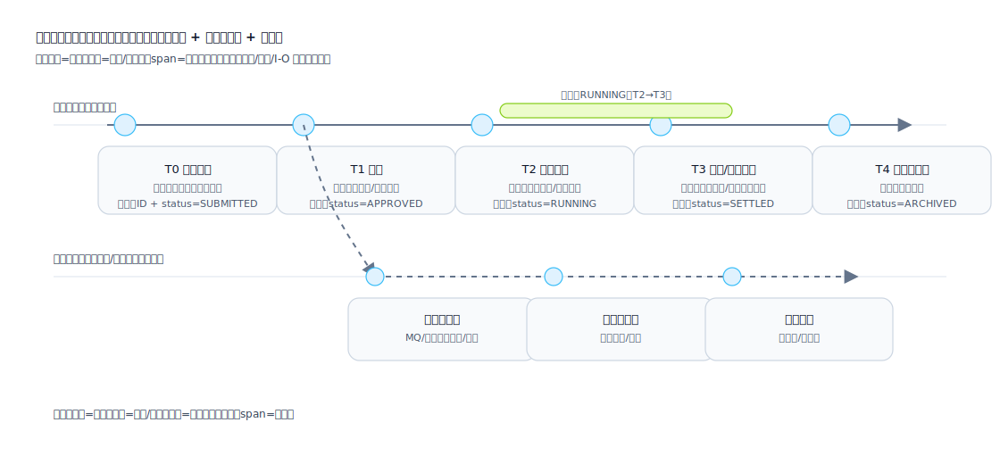

## タイムライン (Timeline)

「時間の経過に伴うイベントの順序、依存関係、並列関係」を表現します。叙述を“検査可能な構造”へ変換し、各段階の入力/出力、責任境界、フォールバック戦略を明確にします。

タイムラインの価値：
- レビューを“チェック可能”にする：各ノードでトリガー、前提、永続化点、出力、責任、失敗時処理を確認できる。
- 並行/非同期を可視化する：承認、実行、通知、照合、補償は並行になりやすく、文章だけでは依存が隠れる。
- 口径を揃える：状態変化、フローチャート、API、定期ジョブ、MQ/コールバックの時系列を1枚に収束する。
- テスト/運用に効く：テストケース（前提/トリガー/期待/タイムアウト）と監視（SLA、リトライ、補償、アラート）へ自然に落ちる。

適用シナリオ:
- ビジネスのライフサイクル (申請 → 承認 → 実行 → 照合/決済 → アーカイブ)
- 状態の進化と主要なマイルストーン (開始/一時停止/ロールバック/終了)
- バージョンリリースのリズム、カナリア、ロールバックウィンドウ、データ移行ウィンドウ

不向き/注意が必要な場面：
- 分岐判断が主のロジック：条件と分岐はフローチャート/判定マトリクスを優先し、タイムラインは重要イベント点に絞る。
- データ構造の定義だけ：データモデル/フィールド仕様を優先する。

推奨される情報:
- 時点/期間: トリガー条件、前提条件、出力結果
- 参加するロール: 誰がトリガーするか/誰が承認するか/誰が実行するか/誰が監視するか
- リスクポイント: 失敗のフォールバック、補償パス、タイムアウト戦略

推奨される出力形式:
- 線形タイムライン (単一のメインスレッド)
- 分岐タイムライン (並列/フォーク/マージ)

## 線とレーンの使い方

主線（実線）：
- ビジネス状態の変化を表す“主因果”の鎖。各ノードは少なくとも1つの検査可能な対象に紐づく：状態フィールド更新、永続化レコード、外部呼び出し結果、観測可能なイベント。

並行/非同期（破線）：
- MQ、コールバック、定期ジョブ、補償タスク、監査ログ、通知など、主線と並行して進み主線によりトリガーされる連鎖。
- “どの主線ノードが起点か”を必ず示し、突然現れるタスクを避ける。

依存（交差線を増やしすぎない）：
- 依存は線で描きすぎず、ノードの注記（例：前提=T1 承認、依存=payment_id 生成済み）で表現して視認性を保つ。

期間（span/バー）：
- 継続状態/ウィンドウ（RUNNING、カナリア、照合、凍結、取消可能期間）を表す。
- 開始/終了の境界と、終了条件（イベント/タイムアウト/手動確認）を明記する。

## ノードに含めるべき情報

最低限（各ノードが答えるべき）：
- トリガー：誰/何が起動するか（ユーザー操作/システムジョブ/コールバック/MQ）
- 前提：必要条件/依存（データ存在/承認済み/在庫ロック等）
- 動作：何をするか（永続化/呼び出し/状態変更/メッセージ送信）
- 出力：何が生成されるか（状態/ID/伝票/メッセージ/ファイル）

推奨（テスト可能・運用可能にする）：
- 責任境界：Owner（役割/システム）と失敗時の担当（誰が対応するか）
- 冪等/重複排除：冪等キー、排除戦略、再実行時の期待動作
- タイムアウト：待機ウィンドウと超過時の処理（リトライ/補償/手動介入）
- 可観測性：ログ/メトリクス/アラート（業務ID、trace_id、重要フィールド）

## 「ノードにするべきか」判定

重要性を検査可能にする：
- 必須：状態を変える、外部可視の結果を出す、不可逆コスト（課金/出荷/消込）を伴う、後続分岐に影響する。
- 推奨：非同期待ち/リトライがある、人の承認がある、クロスシステム境界の呼び出し（コールバック含む）。
- 省略可（ただし説明）：純 UI 表示、純リフレッシュ、文脈から推測できリスクが低い手順。

## よくある失敗（自検用）

- 「何が起きたか」だけで、トリガー/前提/出力がなくテストを書けない。
- 非同期タスクに起点ノードがない、または終了条件がない。
- span が「実行中」だけで、入出条件とタイムアウト戦略がない。
- 依存線を引きすぎて情報が埋もれる：依存はノード注記へ寄せる。
