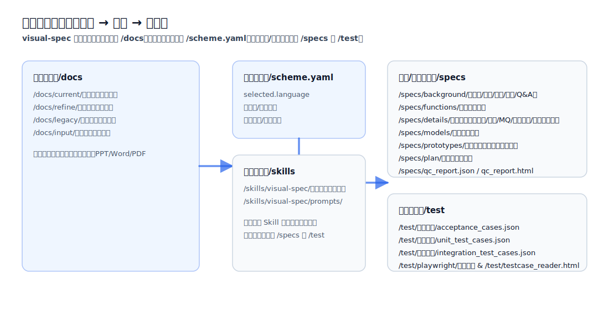

## 工作区目录结构（directories）

本页用于说明 visual-spec 在工作区中的“输入材料、过程产物、最终产物”分别放在哪，以及每类目录的用途。

### 1) 输入材料（你提供的原始信息）

- `/docs/current/`：当前需求相关材料（原始需求、补充说明、截图、表格、PPT/Word/PDF 等）
- `/docs/refine/`：变更与迭代输入（例如 `refine.md`）
- `/docs/legacy/`：遗留系统资料（升级/重构场景）
- `/docs/input/`：统一化后的输入区（常用于 upgrade 的归一化落点）

### 2) 技术选型与生成约束（控制生成的“形态”）

- `/scheme.yaml`：选栈与生成约束（例如前端/后端框架、数据库、目录结构偏好、命名约定）

### 3) 过程产物与最终产物（生成输出）

- `/specs/background/`：背景与口径（需求原文、干系人、术语、开放问题等）
- `/specs/functions/`：功能清单与拆分（后续 detail/plan 的输入之一）
- `/specs/details/`：单功能详细规格（RBAC/校验/交互/日志/通知/MQ/导入导出/定时任务等）
- `/specs/models/`：数据模型与字段定义（通常由 verify 输出）
- `/specs/backend/`：后端工程代码（impl 输出；按技术栈生成 Controller/API、Service、Repository、配置、迁移、以及对应测试代码等）
- `/specs/prototypes/`：可运行原型与评审入口（例如 `scenario.html`、角色 dashboard）
- `/test/验收用例/`：验收用例（[/vspec:accept](../../README.md#commands) 输出，JSON）
- `/test/单元测试/`：单元测试用例（[/vspec:i-test](../../README.md#commands) 输出，JSON）
- `/test/集成测试/`：集成测试用例（[/vspec:i-test](../../README.md#commands) 输出，JSON）
- `/test/playwright/`：Playwright 脚本（[/vspec:script](../../README.md#commands) 输出）
- `/test/testcase_reader.html`：JSON 用例阅读器（单文件 HTML）
- `/specs/plan/`：估算与排期（plan 输出）
- `/specs/qc_report.json`、`/specs/qc_report.html`：质量检查报告（qc 输出）
- `/tests/`：自动化验收测试代码（append-test 输出；若仓库已有测试目录则优先写入既有目录；否则使用 `/tests/`，常见子目录如 `/tests/e2e/`、`/tests/api/`、`/tests/unit/`）

### 4) 技能实现与提示词（仓库自身）

- `/skills/visual-spec/`：Skill 定义与提示词（命令入口与可复用模板）
- `/skills/visual-spec/prompts/`：各命令使用的 prompt（new/detail/verify/qc/plan 等）
