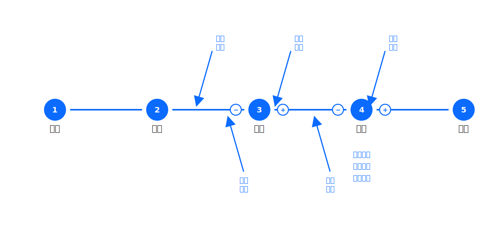
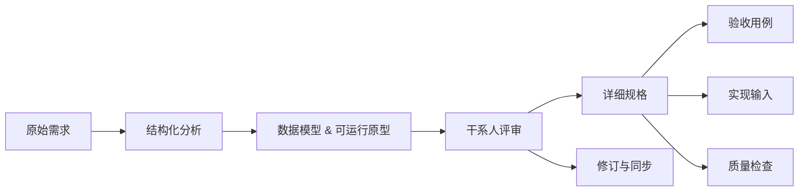

## 设计理念（Theory）

[English](../en-US/theory.md) | [中文](../zh-CN/theory.md) | [日本語](../ja-JP/theory.md)

本节说明 visual-spec Skill 的整体设计理念：它与传统 SDLC（软件开发生命周期）的关系、为什么把流程拆成这些命令步骤、以及为什么用 HTML 输出“场景列表/评审入口”并与原型联动来提升评审效率。同时也解释：为什么 [/vspec:new](../../README.md#commands) 需要分析那么多内容，以及背后的分析思维方式如何拆分为可复用的模块。

另外，我们也会用 flows 抽象把审批/流转类流程统一到同一套可复用骨架上，以便稳定地产出可评审、可落地、可验证的分析结果。

### 工作原理（可视化）

### 阶段地图（Stage Map）

这张图把分析阶段与对应的输入/产出做了映射，便于在讨论需求时明确“当前处于哪个阶段、下一步需要补齐什么”。

### 我们为什么需要 visual-spec？

传统 PRD/规格说明在团队协作中经常反复踩同一类坑：

- 理解偏差：文字描述存在二义性，直到实现/联调才发现“理解错了”
- 反馈滞后：评审发生得太晚，验证成本过高
- 变更灾难：需求一改，下游产物（原型/用例/实现输入）多处不同步，返工不可控

visual-spec 的目标不是“写一份更长的 PRD”，而是用一条可追踪、可评审、可验证的交付链路，把问题前移到编码之前解决：先让干系人对齐“要做什么/不做什么”，再进入实现与测试。

### 核心工作流：理念如何落地

整体路径可以概括为：结构化分析 → 可运行验证 → 细化规格 → 验收与实现输入 → 质量检查与变更同步。

对应到命令与产物：

- 结构化分析：[/vspec:new](../../README.md#commands) 把原始需求拆成可复用的分析产物（角色/术语/流程/场景/功能清单/开放问题等），形成 `/specs/` 的基线
- 可运行验证：[/vspec:verify](../../README.md#commands) 生成数据模型与可运行原型，并输出 HTML 场景评审入口（典型在 `/specs/models/`、`/specs/prototypes/`）
- 规格细化：[/vspec:detail](../../README.md#commands) 把“功能清单”细化为可落地的规格（典型在 `/specs/details/`）
- 验收与实现输入：[/vspec:accept](../../README.md#commands) 把场景转成验收语言（`/specs/acceptance/`）；[/vspec:impl](../../README.md#commands) 生成对接仓库技术栈的实现输入
- 质量与变更闭环：[/vspec:qc](../../README.md#commands) 把质量拆成可检查维度并产出报告；[/vspec:refine](../../README.md#commands) 维护“规范化后的 canonical requirement”并同步更新受影响产物

### 关键设计决策：为什么这样设计

- 评审友好：可运行原型 + HTML 场景入口，比纯文字更适合非技术干系人参与评审；评审的反馈会直接回流到 [/vspec:refine](../../README.md#commands) 的修订闭环
- 模型优先：先把“数据与约束”说清楚，再谈“界面与交互”，能显著降低原型反复改名词/改状态/改边界条件的成本  
  - 详见：[theory/model-before-prototype.md](theory/model-before-prototype.md)
- 变更友好：把 `/specs/` 视为“从同一份规范派生的产物集合”，以 [/vspec:refine](../../README.md#commands) 统一管理变更的源头，避免多份文档各自漂移  
  - 详见：[theory/change-responsiveness.md](theory/change-responsiveness.md)
- 质量可执行：把“需求质量”从抽象评价变成可检查的维度与修复建议，让团队能用 [/vspec:qc](../../README.md#commands) 在进入实现前发现遗漏与矛盾  
  - 详见：[theory/quality_check.md](theory/quality_check.md)

### 阶段地图（命令 → 产出 → V&V 关注点）

| 阶段 | 触发命令 | 核心输入 | 核心产出（常见路径） | V&V 关注点 |
| --- | --- | --- | --- | --- |
| 1. 需求结构化 | [/vspec:new](../../README.md#commands) | 原始需求/背景材料 | `/specs/`（flows/scenarios/functions/questions 等） | 完整性：是否覆盖角色/约束/异常/开放问题 |
| 2. 方案验证 | [/vspec:verify](../../README.md#commands) | 功能清单/流程/场景 | `/specs/models/`、`/specs/prototypes/`（含 HTML 评审入口） | 正确性：行为是否符合场景与约束，歧义是否被消除 |
| 3. 规格细化 | [/vspec:detail](../../README.md#commands) | 功能清单/验证结论 | `/specs/details/` | 一致性：权限/校验/交互/边界条件是否与模型一致 |
| 4. 验收与测试 | [/vspec:accept](../../README.md#commands) | 场景集合/细化规格 | `/specs/acceptance/` | 可验收：用例是否覆盖关键路径与高风险分支 |
| 5. 实现输入 | [/vspec:impl](../../README.md#commands) | 细化规格/仓库约束 | `/specs/backend/`（如启用）与相关集成输入 | 可实施：是否对接实际技术栈与约束 |
| 6. 质量检查 | [/vspec:qc](../../README.md#commands) | `/specs/` 全量产物 | `/specs/qc_report.json`、`/specs/qc_report.html` | 可交付：遗漏/矛盾/不可测试点是否被暴露 |
| 7. 变更同步 | [/vspec:refine](../../README.md#commands) | 评审反馈/新增需求 | 更新 `original.md` 并同步受影响产物 | 可追踪：变更是否被归因并同步到下游 |
| 8. 估算与排期 | [/vspec:plan](../../README.md#commands) | 功能清单/范围约束 | `/specs/plan/plan_estimate.md`、`/specs/plan/plan_schedule.html` | 可计划：范围与拆解是否可评审 |

### 延伸阅读（按生命周期）

| 主题 | 详细文档 | 适合读者 |
| --- | --- | --- |
| SDLC 对齐 | [theory/sdlc.md](theory/sdlc.md) | PM/Tech Lead |
| 需求分析维度 | [theory/new-analysis.md](theory/new-analysis.md) | BA/PM |
| 分析框架 | [theory/thinking-framework.md](theory/thinking-framework.md) | BA/PM |
| 思维方式（含闭环） | [theory/thinking-modes.md](theory/thinking-modes.md) | 所有人 |
| 干系人识别 | [theory/stakeholder-identification.md](theory/stakeholder-identification.md) | BA/PM |
| 抽象（flows） | [theory/abstraction.md](theory/abstraction.md) | BA/Tech Lead |
| 场景分支 | [theory/scenarios.md](theory/scenarios.md) | BA/PM/QA |
| 模型优先 | [theory/model-before-prototype.md](theory/model-before-prototype.md) | BA/Tech Lead |
| 评审友好（原型联动） | [theory/prototype-review.md](theory/prototype-review.md) | PM/Stakeholder |
| 阅读体验（分层阅读） | [theory/reading-experience.md](theory/reading-experience.md) | 所有人 |
| Verification & Validation | [theory/verification_and_validation.md](theory/verification_and_validation.md) | QA/Tech Lead |
| 验收用例（场景驱动） | [theory/acceptance.md](theory/acceptance.md) | QA/Dev/PM |
| 质量检查 | [theory/quality_check.md](theory/quality_check.md) | 所有人 |
| 变更友好 | [theory/change-responsiveness.md](theory/change-responsiveness.md) | PM/Tech Lead |
| 规划与排期 | [theory/planning.md](theory/planning.md) | PM |

### 一句话总结

visual-spec 的核心目标不是“写一份 PRD”，而是把需求变成一套可追踪、可验证、可迭代同步的交付链路：以场景为主线，串起角色、规则、数据与原型，让团队在进入实现前就能用可视化产物完成对齐与评审，并在需求变化时保持下游产物一致更新。
