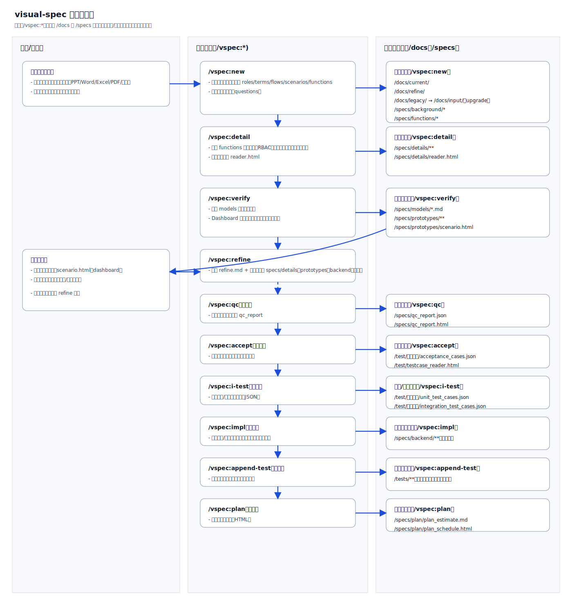
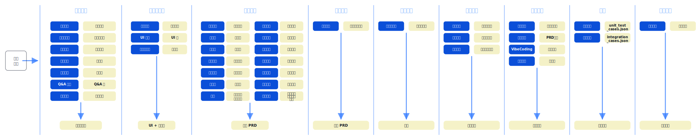

## 设计理念（Theory）

[English](../en-US/theory.md) | [中文](../zh-CN/theory.md) | [日本語](../ja-JP/theory.md)

本节说明 visual-spec Skill 的整体设计理念：它与传统 SDLC（软件开发生命周期）的关系、为什么把流程拆成这些命令步骤、以及为什么用 HTML 输出“场景列表/评审入口”并与原型联动来提升评审效率。同时也解释：为什么 `/vspec:new` 需要分析那么多内容，以及背后的分析思维方式如何拆分为可复用的模块。

另外，我们也会用 flows 抽象把审批/流转类流程统一到同一套可复用骨架上，以便稳定地产出可评审、可落地、可验证的分析结果。

### 工作原理（可视化）

### 阶段地图（Stage Map）

这张图把分析阶段与对应的输入/产出做了映射，便于在讨论需求时明确“当前处于哪个阶段、下一步需要补齐什么”。

### 导览

- SDLC 对齐：为什么要按阶段拆分命令，以及每一步对应 SDLC 的哪个阶段  
  - 详见：[theory/sdlc.md](theory/sdlc.md)
- 规划与排期：如何进行需求分解、估算和排期，以及用户故事地图为什么采用 HTML（`/vspec:plan`）  
  - 详见：[theory/plan.md](theory/plan.md)
- 评审友好：为什么用 HTML 输出场景列表并联动原型，为什么更利于干系人评审  
  - 详见：[theory/prototype-review.md](theory/prototype-review.md)
- Verification & Validation：verification_and_validation 的过程与闭环（review → refine → 再验证）  
  - 详见：[theory/verification_and_validation.md](theory/verification_and_validation.md)
- `/vspec:new`：为什么要分析那么多内容，以及每一类分析产物在后续步骤中的作用  
  - 详见：[theory/new-analysis.md](theory/new-analysis.md)
- 分析方法：把“需求分析思维”拆成可复用的模块化方法  
  - 详见：[theory/thinking-framework.md](theory/thinking-framework.md)

### 一句话总结

visual-spec 的核心目标不是“写一份 PRD”，而是把需求变成一套可追踪、可验证、可迭代同步的交付链路：以场景为主线，串起角色、规则、数据与原型，让团队在进入实现前就能用可视化产物完成对齐与评审，并在需求变化时保持下游产物一致更新。
