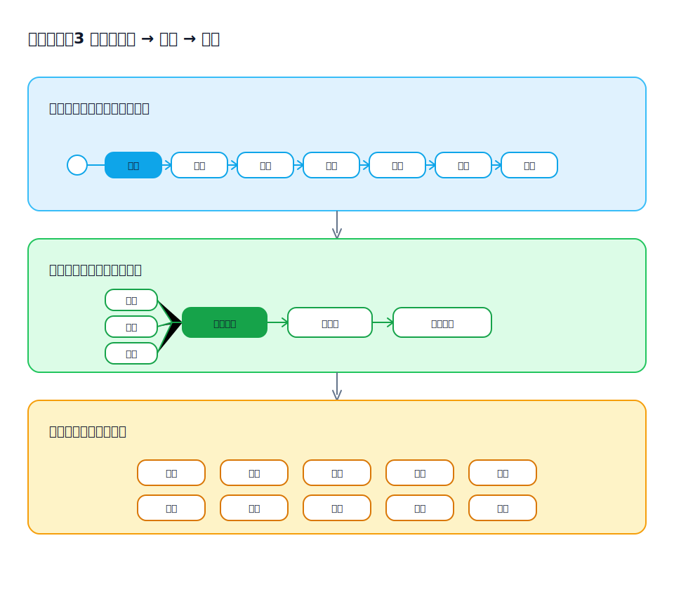

## 为什么要做“层级化”的阅读体验（Reading Ergonomics）

需求理解慢，往往不是信息不够，而是信息的“密度与顺序”不适合阅读：一上来就是细节、术语和边界条件，读者需要在脑中自行拼装全貌，认知负担很高。

visual-spec 倾向把产物组织成可分层阅读的结构，让不同角色都能用更低的成本建立共同理解：先看到全局，再逐层下钻到可实现、可验证的细节。

### 1) 三层阅读：从业务流程到结构，再到细节

分层阅读的关键不是按“文档章节”分层，而是按“理解路径”分层：

- 第一层：整体业务流程（端到端主链路与关键分支），先把系统在做什么跑通
- 第二层：流程节点的构成结构（每个节点由什么构成、输入输出是什么、与前后节点如何衔接）
- 第三层：对第二层构成结构的详细解释（把结构里的要素落到可实现/可验证的细节）

第三层的细节通常包括但不限于：原型表现与交互、校验规则、权限与数据权限、业务逻辑与状态流转、异常与边界、日志/通知/集成点等。

在产物用 HTML 承载并通过链接组织时，这三层会形成一个可跳转的阅读路径：

- 从第一层的流程图/场景列表进入：先选中“要讨论的流程节点/场景”
- 跳到第二层的节点结构：明确这个节点由哪些要素构成（输入、操作、状态变化、输出等）
- 再按要素下钻到第三层细节：打开对应的原型页面、校验/权限/逻辑/状态等规格说明
- 在第三层回链到上层：评审完细节后，能快速回到节点结构或流程总览继续下一个点

读者可以在任意一层停下获得“足够理解”，也可以沿着链接继续下钻，而不必一次性吞下所有细节。

### 2) 让不同干系人用同一份产物“各取所需”

不同角色关心的阅读层级不同：

- 业务/产品：更关心第一层流程是否正确、第二层结构是否完整
- 研发：更关心第二层结构是否可实现、第三层细节是否可落地（校验/权限/逻辑/数据口径）
- 测试/验收：更关心第三层是否能转成可执行的检查清单（前置条件、步骤、期望结果、覆盖的分支）

层级化的组织方式可以减少“同一问题被不同人重复问”的沟通成本，并降低评审时对细节的争论。

### 3) 用“可链接的结构化对象”替代“长文档的线性叙事”

线性长文档对搜索与定位不友好：同一个概念可能散落在多处，修改时容易漏改。把信息落到结构化对象（流程节点、场景、规则、字段、状态、页面）后：

- 定位更快：讨论可以锚定到具体对象，而不是在段落里来回找
- 复用更强：同一规则/口径可以被多个场景引用，避免重复描述
- 变更更稳：变更可以沿引用关系同步影响相关产物，减少口径漂移

### 4) HTML 跳转式阅读 vs Word 线性阅读：差别在哪里

当产物规模变大（场景多、页面多、规则多）时，阅读效率主要取决于“能否按问题快速跳转到答案”，而不是“能否从头读到尾”。

- HTML 的优势是“非线性导航”：目录、锚点、跨文件链接让阅读路径可被即时重组  
  - 从场景列表跳到某个流程节点，再跳到对应原型页面/字段口径/规则细节
  - 评审时可以把讨论锚定到链接目标，减少“我说的是第几页第几段”的沟通成本
  - 更贴合分层阅读：上层负责“导航与定位”，下层负责“解释与验证”，来回切换成本低
- Word 更偏“线性叙事”：适合从头到尾通读，但不擅长在大量内容中做高频定位与来回切换  
  - 当需要在多个位置对照（例如规则 ↔ 原型 ↔ 数据口径）时，读者往往依赖搜索、书签或手动翻页，跳转成本更高

对 visual-spec 来说，层级化阅读更依赖这种“跳转式”能力：第一层看完整流程，第二层看节点结构，第三层按需跳到原型/校验/权限/逻辑等细节，从而更快把疑问闭环掉。

### 5) 结论：更快建立共识，减少“读完才发现理解不一致”

层级化阅读的目标不是把内容拆碎，而是把理解过程产品化：让读者先快速建立全局心智模型，再用链接按需补齐细节，从而更快对齐“我们到底要做什么、边界在哪里、如何验证正确”。
