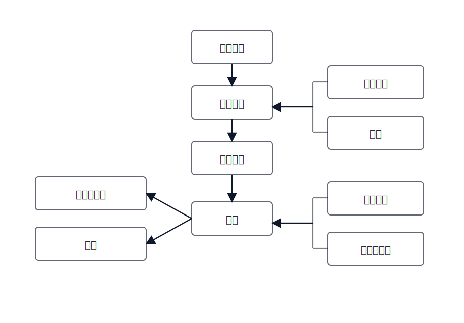

## 干系人识别的思维方式（Stakeholder Thinking）

[English](../../en-US/theory/stakeholder-identification.md) | [中文](../../zh-CN/theory/stakeholder-identification.md) | [日本語](../../ja-JP/theory/stakeholder-identification.md)

干系人识别的目标不是“列一堆角色名”，而是明确：为什么要识别、识别出来能带来什么价值。

同一个需求从不同干系人的角度看，关注点并不相同：有人关心价值与边界，有人关心规则与风险，有人关心执行成本与可运维性，有人关心体验与可用性。把这些视角提前纳入讨论，可以让需求更全面、更可落地，也能减少“上线后才发现漏了谁/漏了什么约束”的返工。

因此，干系人识别要把“需求从哪里来、谁来拍板、谁来执行、谁会被影响、关键约束来自哪里”用一张结构化的图表达出来，避免只采访到某一个层级或某一个部门导致口径失真。

### 1) 组织主链路：从决策到使用

图中纵向的 4 层（高层管理 → 中层管理 → 基层管理 → 用户）表示组织内部“决策传导 → 管理落地 → 一线使用”的主链路：

- 高层管理：确定方向与边界（战略目标、合规底线、投入上限），对关键取舍有最终决策权。
- 中层管理：把目标转成可执行的规则与指标（流程口径、审批规则、资源分配策略），往往决定“如何做”。
- 基层管理：对执行过程负责（排班、异常处理、运营落地），也是很多“隐性规则/约束”的来源。
- 用户：真实的业务操作者与被服务对象，决定了交互、效率与体验边界。

这条主链路的箭头表示：口径与规则会逐层传递，需求评审时也需要保证每一层都有人参与或被覆盖。

### 2) 需求来源与服务对象：客户不仅是来源，也是被服务者

图左侧的“需求传递者”“客户”通过箭头指向“用户”，表示需求往往不是由最终用户直接提出：

- 需求传递者：把一线痛点转述给产品/项目的人（例如运营、客服、实施），经常携带“案例与约束”，但也可能带来偏差，需要回到用户验证。
- 客户：购买/付费/签约方，既是重要的需求来源，也是系统的服务对象；他们带来合同、交付与验收口径，并决定服务体验的成败与边界，因此需要同时从“范围/优先级”与“服务效果/满意度”两条线去验证。

### 3) 约束与旁路影响：合规/顾问/其他部门/第三方

图右侧用括号把干系人分组，表示它们通常不在主链路里“推动流程”，但会以约束、评审意见或外部依赖的形式强影响方案：

- 合规部门 + 顾问（括号组）→ 指向中层管理：合规/制度/外部审查常在“规则与口径”层面生效，要求被转译成可执行的流程与审计点。
- 其他部门 + 第三方公司（括号组）→ 指向用户：跨部门协作与外部系统/服务通常在“执行与使用”层面产生依赖（接口、交接、SLA、故障协同）。

### 输出落点（与 `/vspec:new` 的关系）

- 把主链路与旁路影响写入 baseline 产物（stakeholders/roles），并在每个干系人下补齐：关注点、约束、决策权限与验证口径。
- 把“谁能拍板哪些问题”转成开放问题与决策清单（谁确认规则、谁确认合规、谁确认验收），避免评审缺席导致反复返工。
