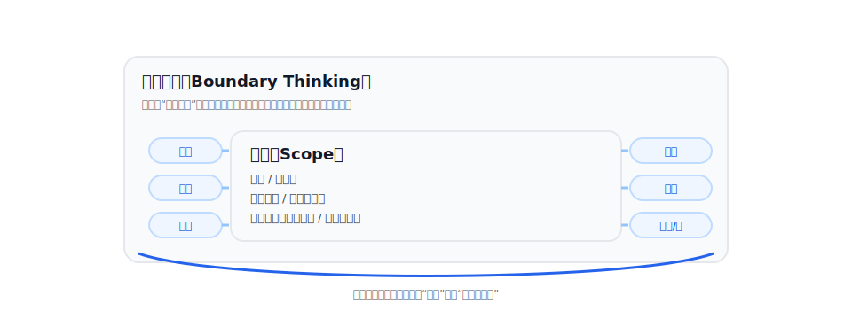
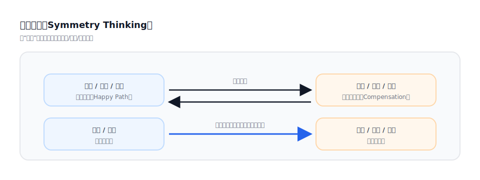
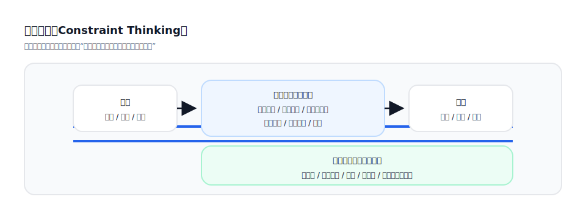
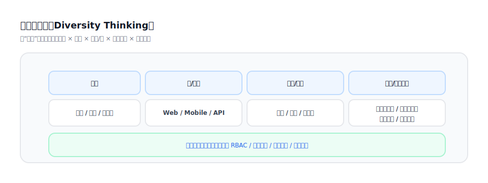
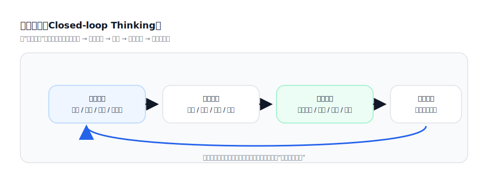
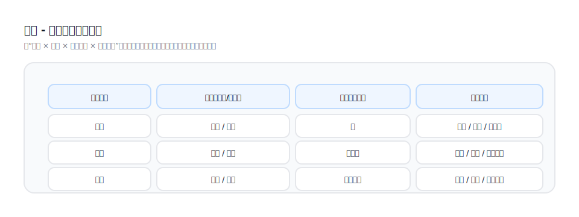

## `/vspec:new` 的分析思维方式：边界/对称/约束/多样性

[English](../../en-US/theory/thinking-modes.md) | [中文](../../zh-CN/theory/thinking-modes.md) | [日本語](../../ja-JP/theory/thinking-modes.md)

本节说明 `/vspec:new` 在“把自然语言需求转成可落地产物”时常用的几类分析思维方式。它们不是模板，而是用来发现缺失信息、矛盾点与关键决策的工具。

### 1) 边界思维（Boundary Thinking）

- 明确边界：目标/非目标、覆盖范围、不覆盖范围、边界条件
- 识别边界对象：角色边界、数据边界、时间边界、组织边界、权限边界
- 典型问题：
  - “这个功能在什么情况下不生效？”
  - “哪些人/哪些数据不允许看到/不允许操作？”

### 2) 对称思维（Symmetry Thinking）

- 用“正向流程”推导“逆向/补偿流程”
- 把“创建”对称为“修改/撤销/回滚/冲正/退款”等
- 把“成功路径”对称为“失败路径/重试/幂等/重复提交”
- 典型问题：
  - “如果上一步做错了，如何恢复？”
  - “重复提交/重复点击会发生什么？”

### 3) 约束思维（Constraint Thinking）

- 把隐性约束显性化：校验规则、权限规则、状态机约束、数据口径约束
- 把系统性约束显性化：可靠性、审计留痕、合规、追踪、告警
- 典型问题：
  - “哪些字段必须满足什么规则才允许提交？”
  - “哪些动作必须留下审计记录？如何追踪？”

### 4) 多样性思维（Diversity Thinking）

- 从多角色、多场景、多渠道、多终端、多组织结构、多业务模式出发做覆盖
- 关注差异：不同角色的目标不同、权限不同、关注指标不同（尤其体现在 dashboard 与原型）
- 典型问题：
  - “同一页面在不同角色下展示有什么差异？”
  - “同一流程在不同渠道/终端/组织下是否不同？”

### 5) 闭环思维（Closed-loop Thinking）

业务需求往往只描述“最关键的一段”，例如某个动作如何发生、某个结果如何产出，但容易遗漏两端：

- 前置处理：进入关键动作之前必须满足的条件、准备哪些数据、做哪些校验/授权/初始化
- 后置处理：关键动作完成之后要同步哪些状态、触发哪些通知/日志/对账/补偿、如何让流程真正结束

闭环思维的目的，是把一个“点状需求”扩成可落地的端到端闭环，确保前置与后置都被分析出来，从而避免只写主链路导致实现与验收阶段暴露大量缺口。

典型问题：

- “触发这个动作之前，必须满足哪些前置条件？缺了会怎样？”
- “这个动作执行成功/失败后，系统分别要做哪些后置处理？”
- “如何确认流程真正结束？是否存在异步通知、重试、补偿或对账？”

### 6) 行动 - 课程映射（示例分析结果）

在课程类产品里，业务需求往往只提“课程/学课”，但容易漏掉让课程真正可用的一组关键行动。做一份“行动 - 课程”的映射表，可以快速补齐入口、权限、校验与状态变化。

示例（节选）：

| 课程对象 | 行动（用户/系统） | 期望状态变化 | 重点规格 |
| --- | --- | --- | --- |
| 课程 | 浏览/搜索 | 无 | 筛选、排序、可见性规则 |
| 课程 | 购买/报名 | 已报名 | 支付、幂等、访问控制 |
| 课时 | 播放/暂停/拖动 | 进度更新 | 进度口径、限流、防刷 |
| 课时 | 完成 | 已完成 | 完成判定、重试、离线同步 |
| 课程 | 发证/证书 | 证书已发 | 资格规则、审计、通知 |
