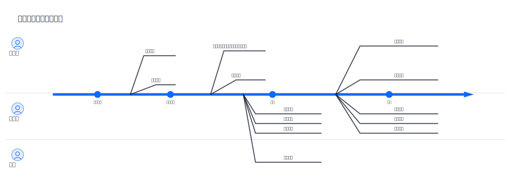

## Verification & Validation：验证与确认的闭环

[English](../../en-US/theory/verification_and_validation.md) | [中文](../../zh-CN/theory/verification_and_validation.md) | [日本語](../../ja-JP/theory/verification_and_validation.md)

在 visual-spec 的流程里，verification（符合规格）与 validation（符合需求）是两类不同的问题，它们需要不同的证据与不同的评审方式。

### 读者导航

- 产品/业务（PM/BA）：重点阅读「执行角色与目标」「visual-spec 中的 V&V 过程」「变更闭环」
- 研发/测试：重点阅读「两个概念的区别」「可操作的 Verification 检查清单」「具体例子」「V&V 过程中的 QC」
- 定制规则/二次开发：参考 Fork 指南了解如何扩展 V&V/QC 规则与提示词：[Fork 定制](../../zh-CN/fork.md)

### 两个概念的区别

- Verification：我们写的规格是否自洽、完整、可实现、可测试、可追踪
- Validation：我们要做的东西是否真的满足目标用户与业务价值，场景是否跑得通

### 使用具体例子（而不是泛泛而谈）

- 例子：规格中写明“任务（Task）有 priority（优先级）字段”，但生成的数据模型 `/specs/models/task.md` 中缺少该字段  
  - 这会导致：原型/接口/验收用例对“优先级”的行为无法对齐，直到实现阶段才暴露
  - 通过 [/vspec:qc](../../../README.md#commands) 的一致性检查，可以把“规格描述 vs 模型缺失”的矛盾显性化，并输出可修复项

### 标准化背景

Verification & Validation（V&V）并不是 visual-spec 独有的概念，而是系统与软件工程中常见的标准化过程。可参考 ISO/IEC 26551:2016 的相关实践，将“符合需求/价值”（validation）与“符合规格/可测”（verification）拆开组织证据与评审，从而降低返工与口径漂移。

### 执行角色与目标

在 visual-spec 的语境里，V&V 不同环节的主要执行角色与目标通常如下：

- Validation（确认）：业务负责人/产品经理/运营等业务侧干系人为主，研发/设计参与
  - 目标：确认场景与交互是否符合业务预期与用户价值，范围是否合理可交付
  - 证据：可运行原型、场景评审入口、关键路径 walkthrough 与评审结论
- Verification（验证）：规格作者/研发负责人/测试负责人为主，必要时业务侧参与确认口径
  - 目标：确认规格自洽、完整、可实现、可测试、可追踪，减少“写了但做不了/测不了/对不齐”的缺口
  - 证据：规则化检查（qc_report）、可测性与追踪性检查项、矛盾/缺失的修复清单

### visual-spec 中的 V&V 过程

1. 明确范围与口径（[/vspec:new](../../../README.md#commands)）
   - 建立共同语言：角色、术语、场景、流程、功能清单、依赖、开放问题
2. 规格细化（[/vspec:detail](../../../README.md#commands)）
   - 把功能展开到可实现/可测试粒度，形成可追溯的细节规格
3. Validation（[/vspec:verify](../../../README.md#commands) + 干系人评审）
   - 通过可运行原型 + 场景评审入口验证“行为是否符合预期”
   - 在“评审与确认”环节中，允许划定场景范围：明确本次评审/验收要覆盖哪些关键场景，避免范围不清导致评审无结论
4. Verification（[/vspec:qc](../../../README.md#commands)）
   - 用规则化检查发现遗漏/矛盾/不可测/不可追踪，并沉淀为可修复项
5. 变更闭环（[/vspec:refine](../../../README.md#commands)）
   - 把评审结论与 QC 修复点写入 refine 输入，驱动下游产物同步更新，然后再次进行验证/检查

### 可操作的 Verification 检查清单

一份“可执行”的规格检查，不是只说“要完整”，而是能落到具体可核对项：

- 每条功能点都能对应至少 1 条验收标准（Acceptance Criteria），并能映射到场景/流程
- 外部依赖清单是显式的（系统/API/webhook/topic/文件），且在规格中可追踪到发生在哪些场景/功能
- 数据模型没有“悬空引用”：外键/关联字段都有明确来源、口径与约束
- 关键规则有可测表述：权限、状态机、字段校验、异常分支、幂等/重试等不以“实现自定”收尾
- [/vspec:qc](../../../README.md#commands) 报告中没有 CRITICAL 问题，且每个问题都有明确修复结论（修复/不适用/延期并标注原因）

### 为什么要把 V 与 V 分开

- 证据不同：验证需要“可运行的行为证据”，确认需要“规格一致性与可测证据”
- 评审对象不同：业务更擅长在原型与场景里发现偏差，研发/测试更擅长在规格与可测性里发现缺口
- 结论更可执行：先划定场景范围，再评审并落地到 refine，能把意见变成可追踪的修改任务
