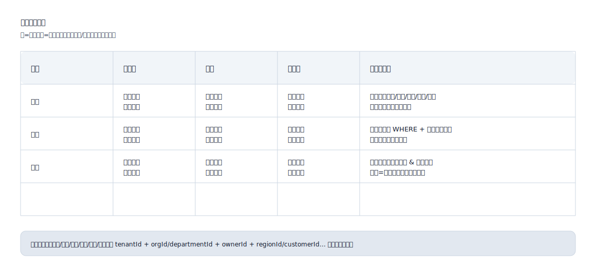

## 数据权限（Data Permissions）

用于把“同一角色在不同数据范围下能看到/能操作哪些数据”显式化，避免 RBAC 只解决“能不能点”，却没解决“能看哪些数据、能改哪些数据”。

适用场景：
- 多租户/多组织/多部门/多项目/多区域的数据隔离
- 需要按创建人、所属组织、业务线、客户、区域、资源归属进行数据范围控制

常见数据范围维度：
- 租户：tenantId
- 组织：orgId / departmentId
- 归属：ownerId / assigneeId / dispatcherId / driverId
- 区域：regionId / cityCode / siteId
- 业务对象：customerId / projectId / fleetId

数据权限表格格式（SVG 示例）：

