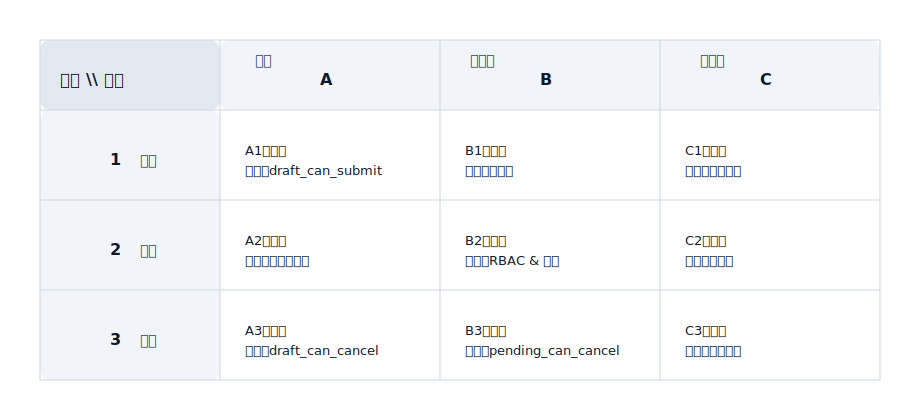

## 决策矩阵（Decision Matrix）

用于表达“在多个可选动作/策略之间如何选择”，强调可解释性：为什么选 A 而不是 B。

适用场景：
- 路由策略（走自动化还是人工、走哪个通道/供应商）
- 资源分配（库存分配、额度分配、队列优先级）
- 降级与容错（失败后切换策略、重试/回退）

矩阵定义（正交矩阵）：
- 横轴：状态（State），用字母坐标标记：A / B / C ...
- 纵轴：动作（Action），用数字坐标标记：1 / 2 / 3 ...
- 单元格：当「状态=列」且「动作=行」时的决策结果与规则入口

决策矩阵示例（SVG）：

坐标驱动的规则描述（用坐标引用逻辑，而不是重复写一段话）：
- A1：状态=Draft，动作=Submit → 允许；规则入口：`draft_can_submit`（RBAC + 字段校验 + 幂等校验）
- B2：状态=Pending，动作=Approve → 允许；规则入口：`rbac & quota`（权限点 + 配额/额度 + 审批链）
- C3：状态=Approved，动作=Cancel → 禁止；原因：已审批不可取消（统一错误码与提示文案）
