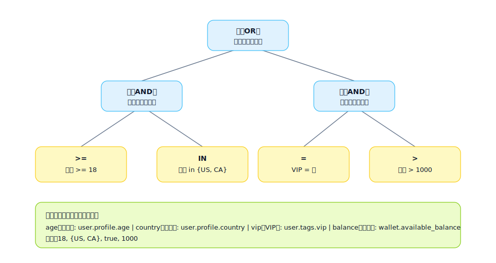

## 表达式树（Expression Tree）

用于表达“复杂条件/公式的可计算结构”，把长条件拆成可复用子表达式，便于实现与测试。

适用场景：
- 复杂准入/风控条件（AND/OR/NOT 组合很深）
- 计费/评分/排序公式
- 权限判定（角色 + 数据范围 + 状态）

表达式树的作用：
- 让复杂规则可计算：把“长条件/长公式”拆成一棵树，执行时按树结构递归求值
- 让规则可解释：每个节点都有明确语义，可用于日志、审计、错误提示、回溯定位
- 让规则可复用/可测试：子树可以命名、复用，并对关键子树做单测覆盖

节点的作用（最小集合）：
- 运算节点：AND/OR/NOT，决定组合逻辑与短路策略
- 比较节点：= / != / > / >= / IN / LIKE 等，负责把“字段值”与“常量/另一个字段”做判断
- 函数节点：如 `contains` / `regex` / `abs` / `round` / `date_diff`，把输入加工成可比较值
- 叶子节点：字段（Field）与常量（Const），提供可追踪的数据来源

表达式树示例（SVG）：

