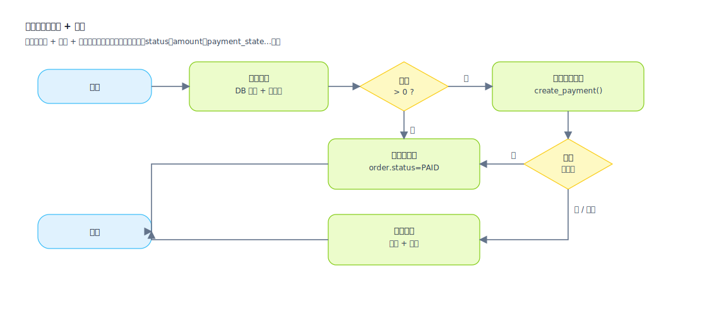

## 流程图（Flowchart）

用于表达“业务步骤与分支”，聚焦动作（Action）与条件（Decision），适合评审“流程是否完整、分支是否可落地”。

应用场景（什么时候一定要画流程图）：
- 业务主流程 + 异常/回滚流程需要一起评审时（避免只写 happy path）
- 分支条件需要落到字段/状态/权限/额度等“可实现输入”时
- 存在超时、重试、补偿、人工介入、并行汇合等控制流时
- 需要把“跨系统编排”说清楚时（调用外部系统/队列/通知/对账）

表达价值（为什么要画）：
- 让分支可落地：每个 Decision 都能映射到明确字段来源，避免“凭感觉分支”
- 让责任可分解：每个 Action 都能对应到页面操作/API/任务/消息，便于拆解与估时
- 让风险可暴露：超时、失败、重试、补偿、幂等点在图上可见，便于提前设计
- 让测试可生成：可直接从节点链生成场景与用例（主链路/异常链路/边界链路）

流程图示例（SVG）：

