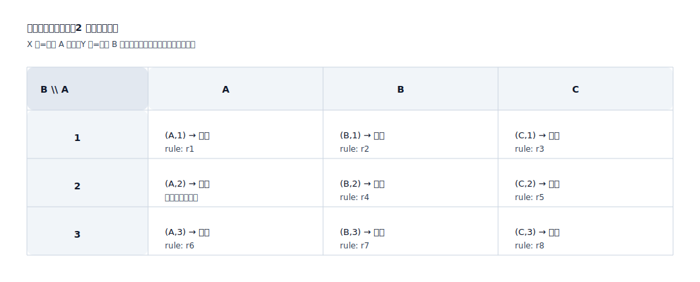
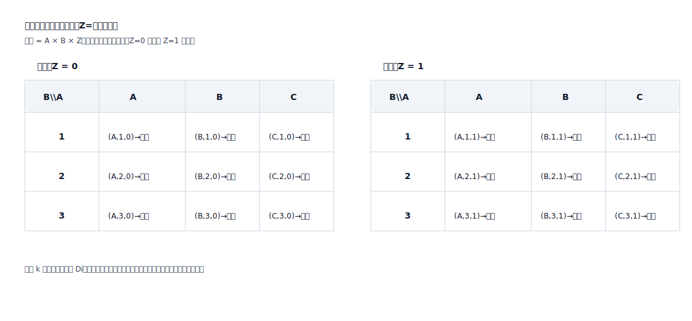

## 判定矩阵（Judgment Matrix）

用于把“条件组合 → 判定结果”显式化，避免隐含规则散落在文字中，便于评审与测试覆盖。

适用场景：
- 资格/准入判定（是否可申请、是否可执行）
- 风控/合规判定（是否拦截、是否转人工、是否需要补充材料）
- 计费/优惠/结算规则（费率选择、封顶、阶梯）

数学原理（排列组合 / 笛卡尔积）：
- 判定矩阵本质上是在枚举“条件维度”的笛卡尔积：`C = D1 × D2 × ... × Dk`
- 每个维度 `Di` 是某个关键条件的取值集合（枚举值/区间桶/阈值段/布尔值）
- 组合总数：`|C| = Π |Di|`（维度越多、每维取值越多，组合数按乘法增长）
- 矩阵的意义：把每个组合映射到唯一结果 `f(c) -> outcome`，并让每个 outcome 可追踪到坐标（组合）

表达价值（为什么用矩阵）：
- 覆盖可见：哪些组合没定义、哪些组合走默认兜底一眼可见
- 冲突可控：同一组合只能有一个结果；冲突/优先级必须显式化
- 用例可生成：每个坐标就是一条可执行测试输入（可按风险抽样或全覆盖）

二维正交矩阵格式（SVG 示例）：

多维判定矩阵结构（SVG 示例：第 3 维用“切片”表达）：

测试映射：
- 每一行/每一类组合都应对应至少 1 条验收用例
