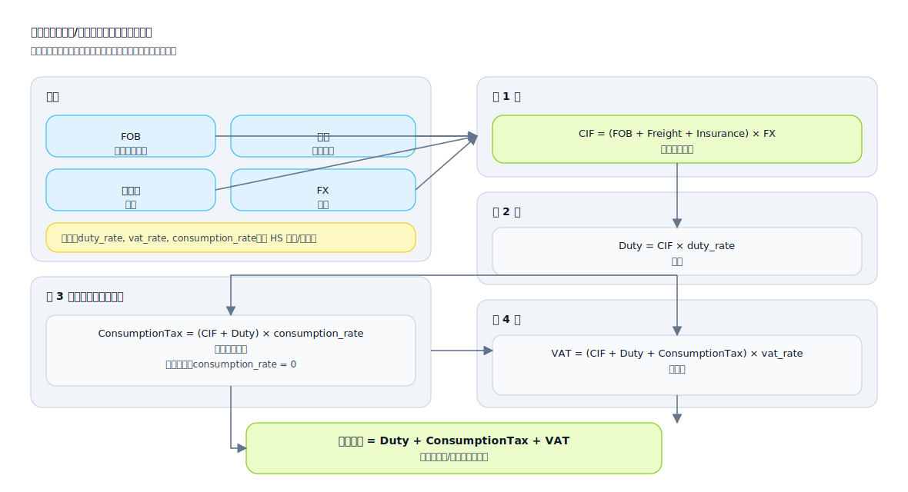

## 数学公式（Math Formulas）

用于把“可计算规则”明确成符号化表达，并补齐变量定义、单位与边界条件，减少实现偏差。

适用场景：
- 计费/优惠/分摊/结算
- 指标口径（统计、同比环比、归一化、评分）
- 风控评分、阈值与权重模型

建议包含的信息：
- 公式本体：变量、常量、函数
- 变量定义：来源字段、单位、精度、取值范围
- 边界与异常：除零、空值、负数、溢出与取整策略
- 示例：给一组输入与期望输出，作为验收用例基线

复杂公式示例（SVG：海关关税/税费计算器）

