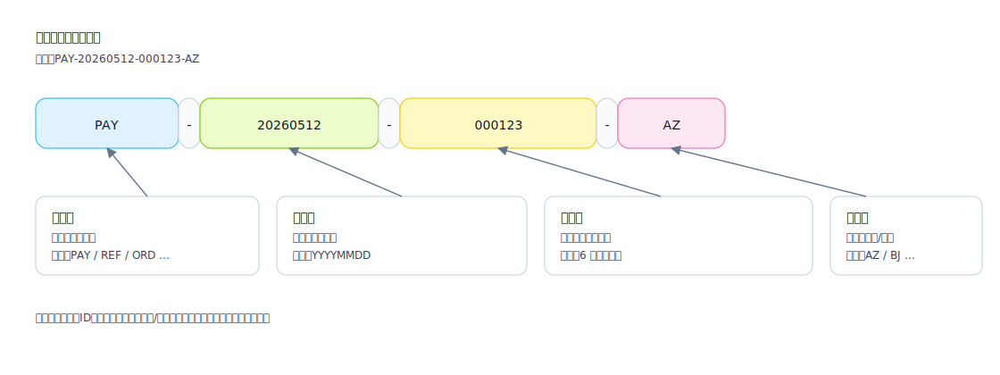

## 编号规则（Numbering Rules）

用于定义“单据/实体的唯一编号生成策略”，确保可追踪、可对账、可排障。

适用场景：
- 业务单据号（申请单/订单/退款单）
- 对账批次号、导入批次号、任务执行批次号

建议包含的信息：
- 格式：前缀/日期/序列/分段规则（例如 `PAY-20260512-000123`）
- 生成时机：创建时生成 / 审批通过后生成 / 外部回传后生成
- 并发与去重：雪花/数据库序列/分布式号段
- 可读性与敏感信息：避免泄露用户隐私与业务机密

编号示例（SVG）：

