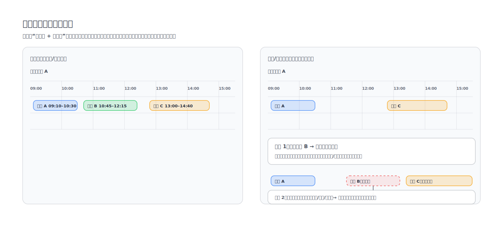

资源日历模型表示“一个资源在一个时间段内可以被怎样使用”，用时间轴上的占用情况来表达资源的可用性、已占用与约束，从而支持排班、派车、冲突检测、紧急调整等场景。

## 基础概念

- 资源：可被分配/调度的对象，例如车辆、司机、派车员、会议室、产线设备等。
- 时间窗：某段时间内资源可用/不可用/占用的状态定义。
- 占用（booking）：把资源在某个时间窗“锁住”的记录，通常关联到某个业务单据或任务。
- 约束：对占用可行性的限制条件，例如最大连续工作时长、必须休息时段、区域/位置限制、接驳/路程时间等。

## 核心概念

- 资源日历 = 默认可用性 + 例外 + 占用 + 约束。
- 资源是否“可用”，不是一个静态结论，而是与时间窗、占用冲突、以及约束共同决定的结果。

## 建议字段（示例）

- id：日历模型 ID
- resourceType：资源类型（vehicle/driver/dispatcher/...）
- resourceId：资源唯一标识
- timeZone：时区
- weeklyAvailability：按周重复的默认可用时间段
- exceptions：特殊日期例外（节假日、临时不可用、临时加班）
- bookings：已占用记录（开始/结束、关联单据、占用类型）
- constraints：约束规则集合（可选）
- updatedAt：最后更新时间

## 删除/变更占用的影响

删除或变更某个占用时，影响的范围取决于占用之间是否存在“依赖”和“约束耦合”。

- 毫无影响：其他占用与该占用没有时间冲突，也没有顺序依赖或共享约束（例如同一资源但占用互不相邻，且不需要考虑路程/接驳）。
- 影响较小：只需要在同一资源上重新做一次冲突检测，确认后续占用仍然可行。
- 影响较大：存在制约因素导致连锁调整，例如：
  - 位置/路程：占用 A 在城区，紧接着占用 C 在郊区，若占用 B 的时间或地点变化会改变可达性，导致 C 必须延后或换资源。
  - 顺序依赖：后续占用依赖前序占用的完成（例如返程后才能执行下一单、设备换线后才能生产下一批）。
  - 法规/规则：司机工时、强制休息、产线维护窗口等，导致一处变化会触发多处重新排程。

## 常见用法

- 冲突检测：新派车/变更与既有 bookings、exceptions 进行时间区间冲突判定。
- 影响分析：变更时间/人数/出发地/目的地时，评估车辆与司机是否仍满足 availability 与 constraints。
- 撤销/紧急调整：撤销分派、紧急停止、紧急变更时，回滚或重排相关 bookings。

## 适用场景

- 派车/排班：车辆与司机是典型资源，订单是占用，位置与路程是关键约束。
- 航班延误：航班/机组/登机口是资源，延误会把占用后移并引发航班链路与机组工时的连锁影响。
- 工厂排产：产线/设备/模具是资源，工单是占用，换线时间、维护窗口与物料到货是常见约束。
