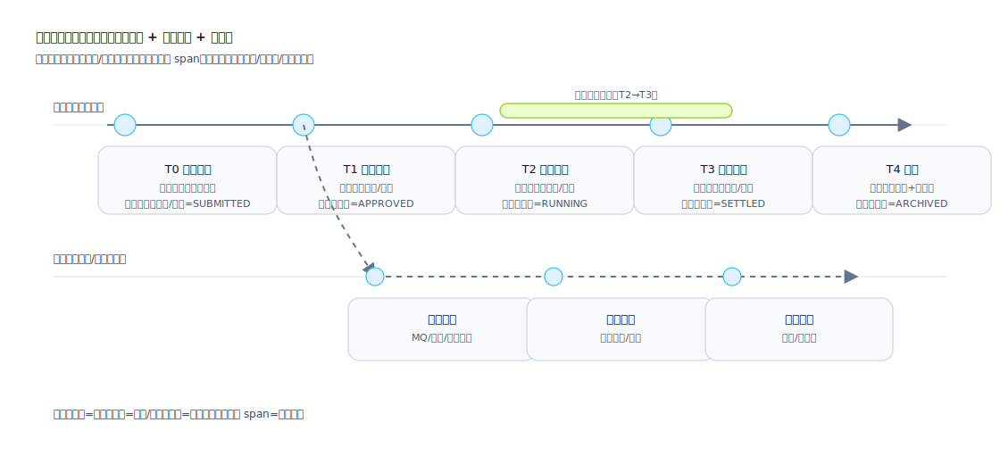

## 时间轴（Timeline）

用于表达“事件随时间发生的顺序、依赖与并行关系”，把过程从“叙述文本”变成“可检查的结构”，并明确每个阶段的输入/产出、责任边界与回退策略。

时间轴的价值：
- 让评审从“看起来合理”变为“逐节点核对”：每个节点是否有触发条件、落库点、输出物、责任人、失败处理。
- 把并行与异步显性化：审批、执行、通知、对账、补偿通常并行推进，单一主线文字会掩盖关键依赖。
- 统一口径：把状态机、流程图、接口调用、定时任务/MQ 的发生时序收敛到同一张图，避免互相打架。
- 支撑测试与运维：时间轴天然映射测试用例（前置/触发/期望/超时）与监控点（SLA、重试、补偿、告警）。

适用场景：
- 业务生命周期（申请 → 审批 → 执行 → 对账/结算 → 归档）
- 状态演进与关键里程碑（开始/暂停/回滚/终止）
- 版本发布节奏、灰度、回滚窗口、数据迁移窗口

不适用/需要谨慎的场景：
- 强分支决策为主的逻辑：优先用流程图/判定矩阵表达“条件与分支”，时间轴只保留关键事件点。
- 单纯的数据结构定义：优先用数据模型/字段说明表达。

建议包含的信息：
- 时间点/时间段：触发条件、前置依赖、输出结果
- 参与角色：谁触发/谁审批/谁执行/谁监控
- 风险点：失败回退、补偿路径、超时策略

产出形式建议：
- 线性时间轴（单主线）
- 带分支时间轴（并行/分叉/合并）

## 线条与泳道用法

主线（实线）：
- 表达业务状态随时间演进的“主因果链”，每个节点应能对应到至少一个可检查对象：状态字段变化、落库记录、外部调用结果、可观测事件。

并行线/异步线（虚线）：
- 用于 MQ、回调、定时任务、补偿任务、审计日志、通知等“与主线并行但受主线触发”的链路。
- 虚线必须标注“触发点来自哪个主线节点”，避免“凭空出现的任务”。

依赖关系（建议在节点上标注，而不是画满交叉线）：
- 用“前置：T1 审批通过”或“依赖：payment_id 已生成”等文本描述依赖，减少视觉噪音。

时间段（span/条形）：
- 表达“持续状态/窗口期”，例如：执行中（RUNNING）、灰度窗口、对账窗口、冻结期、撤销窗口。
- span 必须有开始/结束边界（来自哪个节点到哪个节点），并注明结束条件（事件/超时/人工确认）。

## 节点应该包含哪些信息

最低信息集（每个节点都要能回答）：
- 触发：谁/什么触发（用户动作/系统任务/回调/MQ）
- 前置：需要满足的条件/依赖（数据存在/审批通过/库存锁定）
- 动作：做了什么（落库/调用/状态变更/发消息）
- 输出：产生什么结果（状态/单号/凭证/消息/文件）

推荐信息集（用于可测试与可运维）：
- 责任边界：Owner（角色/系统）+ 失败归属（谁处理）
- 幂等与去重：幂等键/去重策略/重复触发的期望行为
- 超时：等待窗口与超时后的处理（重试/补偿/人工介入）
- 可观测性：日志/埋点/告警（关键字段、trace_id、业务单号）

## “节点是否包含”判定要领

把“重要性”落到可检查的标准：
- 必须包含：会改变业务状态、会产生对外可见结果、会引入不可逆成本（扣款/发货/核销）、会影响后续分支的事件。
- 建议包含：需要异步等待/重试的环节、需要人工介入/审批的环节、跨系统边界的调用（含回调）。
- 可以不画但要有说明：纯 UI 细节、纯展示刷新、可从上下文推导且无风险的步骤。

## 常见错误（用于自检）

- 只有“发生了什么”，没有“触发/前置/输出”，导致无法写测试用例。
- 异步任务没有来源节点，或没有结束条件（永远在跑）。
- span 只写“执行中”，不写进入/退出条件与超时策略。
- 依赖关系画得过于复杂，交叉线淹没信息：优先写在节点的“前置/依赖”字段里。
